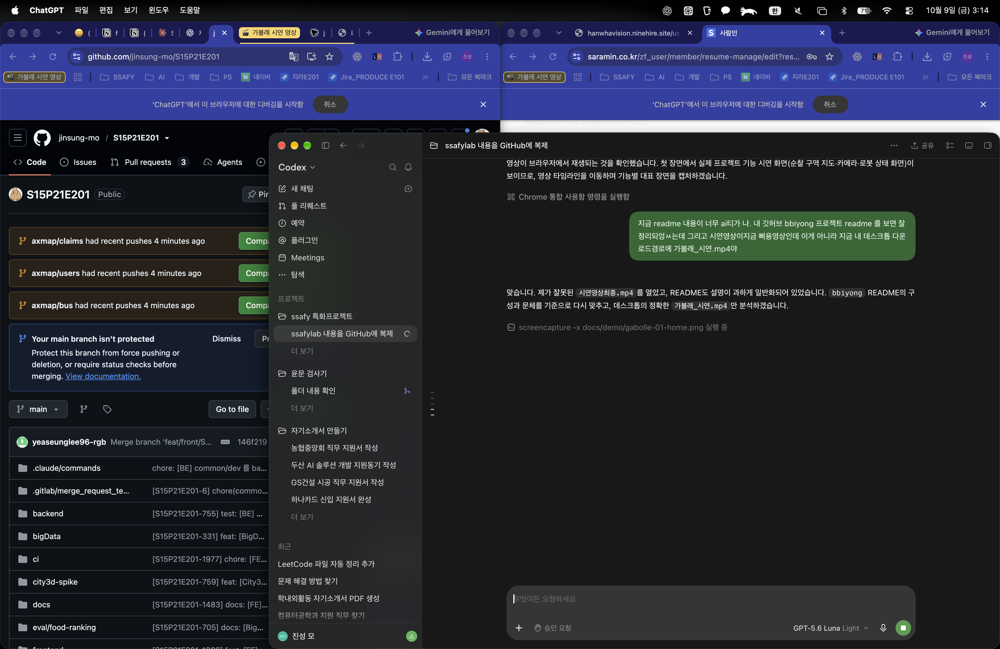
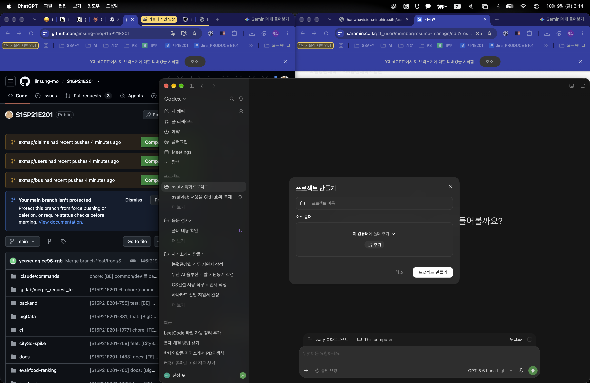
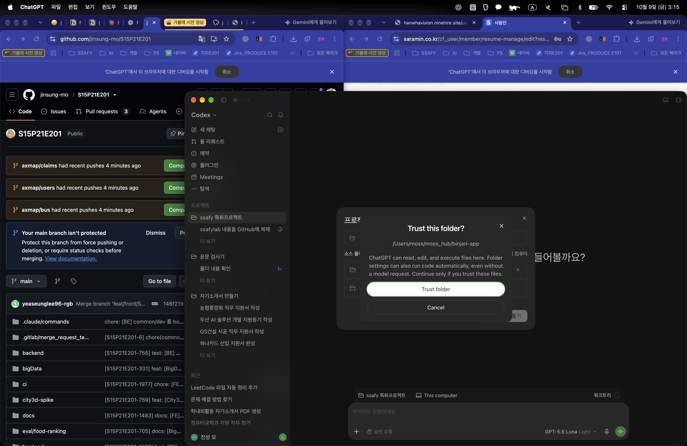
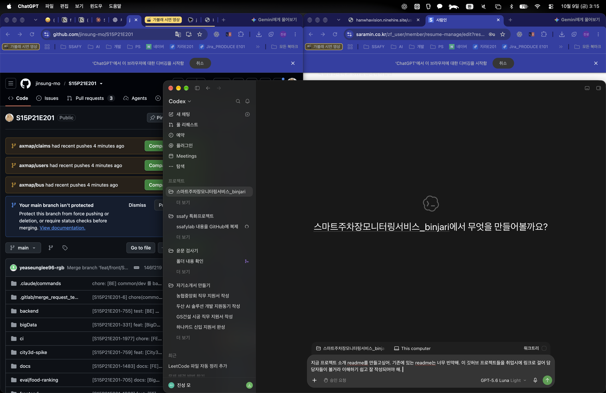
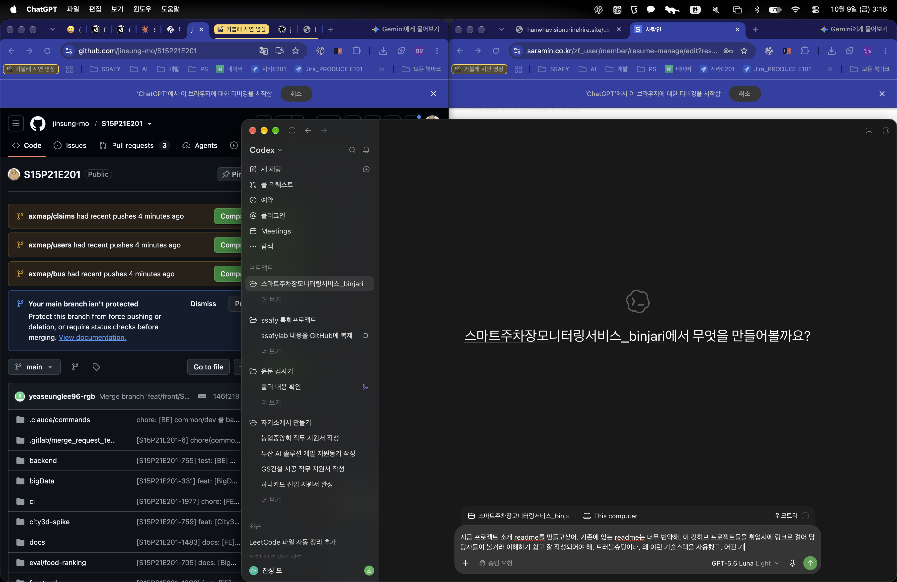

# 가볼래 · GABOLLE

부산의 모든 여행, 가볼래?

SSAFY 15기 자율 프로젝트 · 부울경 E201 · 6인 팀

## 프로젝트 한눈에 보기

가볼래는 여행자의 취향과 여행 조건을 바탕으로 부산 여행을 계획하는 서비스입니다.

여행지를 많이 보여주는 것보다, **누구와 언제 가는지**, **어디서 출발하는지**, **어떤 이동을 원하는지**, **어떤 여행을 좋아하는지**를 먼저 묻습니다. 사용자가 입력한 조건에 맞춰 장소를 고르고, 선택한 장소를 일정으로 이어 갈 수 있도록 만들었습니다.

## 왜 만들었나

부산 여행을 준비할 때 장소를 찾는 일과 일정을 짜는 일이 따로 진행됩니다. 검색 결과는 많지만 내 여행 기간과 동행 인원, 이동 수단, 취향에 맞는 곳을 다시 골라야 합니다.

가볼래는 여행을 시작하기 전에 필요한 조건을 한 번에 받습니다.

- 당일치기부터 3박 4일까지 여행 기간 선택
- 출발지와 숙소 지역 설정
- 대중교통·자동차·도보 위주 이동 선택
- 하루 여행 시간 설정
- 바다·도심·카페·문화·맛집·자연·축제 등 여행 취향 선택
- 걷는 거리와 경사 같은 개인 이동 조건 저장
- 저장한 후보 장소 중 꼭 가고 싶은 장소 선택

이렇게 정한 조건은 마지막 여행 카드에서 다시 확인할 수 있고, 사용자가 직접 수정할 수 있습니다.

## 주요 기능

- **홈** — 여행 계획 시작, 부산에서 남긴 기록, 현재 열리는 부산 행사 확인
- **지역 행사 탐색** — 행사 기간·장소·입장 정보를 확인하고 내 일정에 추가
- **여행 만들기** — 날짜, 인원, 출발지, 숙소, 이동 수단, 하루 여행 시간 입력
- **취향 선택** — 최대 3개의 여행 카테고리와 여행 속도 선택
- **여행 조건** — 한 번에 걸을 수 있는 거리, 경사 회피, 알레르기 등 조건 저장
- **후보 장소 선택** — 저장된 장소를 선택하거나 장소명으로 검색
- **여행 미리보기** — 출발지·숙소·여행 기간·인원·예산·취향·이동 조건을 한 화면에서 확인
- **일정 생성** — 입력한 조건으로 실제 여행 일정 만들기

### AI 여행 도우미

홈 화면의 AI 버튼에서 여행 준비를 대화로 도와줍니다.

- 부산 여행을 어디서부터 시작할지 모를 때 여행 만들기로 연결
- 여행 기간·동행·취향·이동 조건을 바탕으로 다음에 입력할 항목 안내
- 현재 보고 있는 장소나 축제 정보를 바탕으로 관련 여행 후보 탐색
- 추천 결과를 확인한 뒤 마음에 드는 장소를 여행 후보에 저장
- 챗봇은 여행을 대신 확정하지 않고, 사용자가 조건을 확인하고 직접 일정 생성을 선택하도록 구성

## 화면과 시연

시연 영상: `가볼래_시연.mp4`

원본 영상은 저장소에 직접 커밋하지 않고, 기능별 대표 화면을 캡처해 남겼습니다.

| 홈·AI 여행 도우미 | 행사·장소 탐색 |
|---|---|
|  |  |

| 여행 날짜·인원 | 출발지·숙소·이동 수단 |
|---|---|
|  |  |

| 여행 취향 | 여행 조건 미리보기 |
|---|---|
|  |  |

## 핵심 흐름

```text
홈
  → 여행 만들기
  → 날짜·인원 선택
  → 출발지·숙소·이동 수단 선택
  → 여행 취향 선택
  → 여행 조건 확인
  → 저장한 후보 장소 선택
  → 여행 조건 미리보기
  → 일정 만들기
```

## 기술 스택

| 분야 | 기술 |
|---|---|
| Client | Expo, React Native, TypeScript |
| 화면·상태 | Expo Router, React Query |
| Backend | Spring Boot, Java 17, Gradle |
| Database | PostgreSQL 16, Spring Data JPA, Flyway |
| 인증 | Spring Security, OAuth2, JWT |
| 데이터 | Python, Node.js, OpenStreetMap, 부산 공공데이터 |
| 배포·운영 | Docker Compose, Jenkins, Nginx |
| 테스트 | Jest, Playwright, Maestro, Testcontainers |

## 시스템 구성

여행자가 앱에서 조건을 입력하면 서버가 사용자·여행·장소·일정 데이터를 관리합니다. 부산의 장소·교통·지형 데이터는 별도 수집·가공 영역에서 관리하고, 추천과 경로 계산에 사용할 수 있도록 내부 장소 기준으로 연결합니다.

```text
┌────────────────────┐
│ Expo React Native   │
│ iOS · Android · Web │
└─────────┬──────────┘
          │ REST API
┌─────────▼──────────┐
│ Spring Boot         │
│ 회원 · 장소 · 여행  │
│ 일정 · 추천         │
└──────┬─────────┬───┘
       │         │
┌──────▼─────┐ ┌─▼──────────────┐
│ PostgreSQL  │ │ Data / Ranking │
│ + Flyway    │ │ Python·Node.js │
└─────────────┘ └────────────────┘
```

## 기술적으로 신경 쓴 부분

- 여행 조건을 일정 생성 전에 저장해 추천과 일정 계산에 같은 값을 사용하도록 구성했습니다.
- 장소명과 주소 표기가 달라도 내부 장소 ID로 연결할 수 있도록 데이터 수집·정규화 과정을 분리했습니다.
- 부산의 경사와 실제 보행 거리를 고려할 수 있도록 고도·도로·도시철도 출구 데이터를 별도로 가공했습니다.
- 모바일 화면과 웹 화면을 같은 Expo 코드베이스에서 확인할 수 있도록 구성했습니다.
- 인증, 여행, 장소, 일정 기능을 나누고 각 기능의 API와 데이터 책임을 분리했습니다.

## 실행 안내

### 필요한 환경

- Node.js 20 이상
- Java 17 이상
- Docker Desktop

### Frontend

```bash
cd frontend
cp .env.example .env
npm install
npm run web
```

모바일 실행:

```bash
npm run ios
# 또는
npm run android
```

### Backend

```bash
cd backend
cp .env.example .env
docker compose up --build -d
```

서버 상태 확인:

```text
http://localhost:8080/actuator/health
```

OAuth와 데이터베이스 환경변수는 [backend/README.md](backend/README.md)를 참고합니다. 비밀값은 저장소에 올리지 않습니다.

## 저장소 구조

```text
frontend/            Expo 기반 앱
backend/             Spring Boot API 서버
bigData/              부산 장소·교통·지형 데이터 수집·가공
infra/                추천 인프라·운영 설정
docs/gabolle/         기획·요구사항·API·화면 설계 문서
survey-place/         장소 데이터 수집 설문
survey-recommend/     부산 추천 장소 설문
```

## 문서

- [통합 서비스 기획서](docs/gabolle/GABOLLE_통합_서비스_기획서_v1.1.docx)
- [요구사항 명세서](docs/gabolle/GABOLLE_요구사항_명세서_v1.1.docx)
- [API 명세서](docs/gabolle/GABOLLE_API_명세서_v1.1.docx)
- [기능·화면 상세 설계서](docs/gabolle/GABOLLE_기능_화면_상세설계서.docx)
- [화면 흐름·정보 구조](docs/gabolle/GABOLLE_화면흐름_및_정보구조_명세서_v1.1.docx)
- [사용자 시나리오·인수 기준](docs/gabolle/GABOLLE_사용자_시나리오_및_인수기준_v1.1.docx)

## 팀 구성

여섯 명이 Backend, Frontend, Data, Recommendation/AI, DevOps/QA 영역을 나누어 개발했습니다.

| 이름 | 담당 |
|---|---|
| 박재현 | DevOps · Infra |
| 장효준 | Backend · Recommendation/AI |
| 고지혁 | Backend · Data |
| 모진성 | Backend · 프로젝트 통합 |
| 이승현 | Frontend |
| 이예승 | Frontend · 기획 |

## License

SSAFY 팀 프로젝트입니다. 자세한 내용은 [LICENSE](LICENSE)를 참고하세요.
