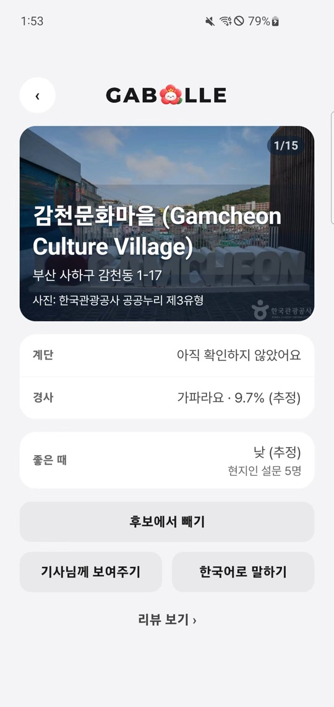
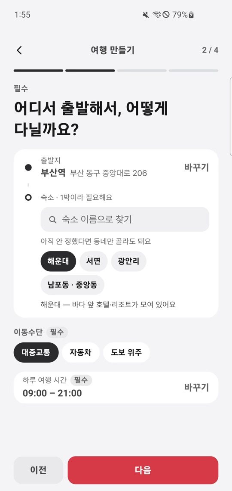
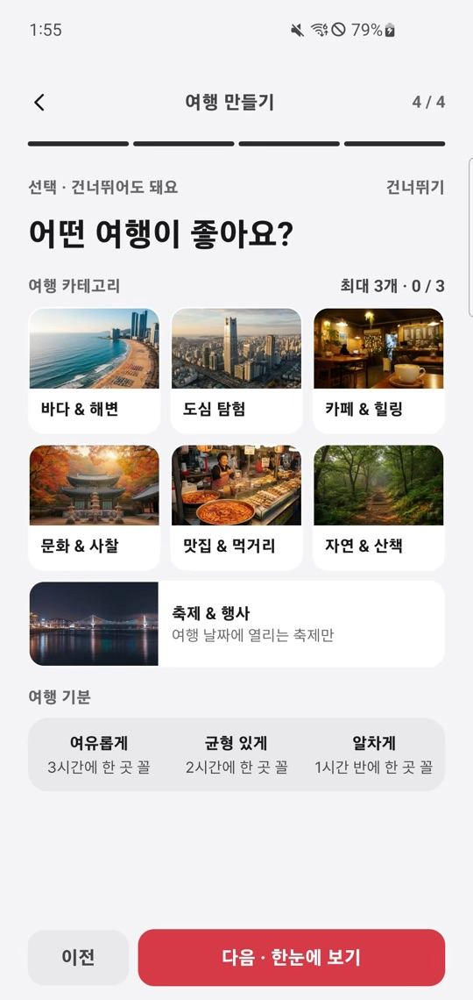
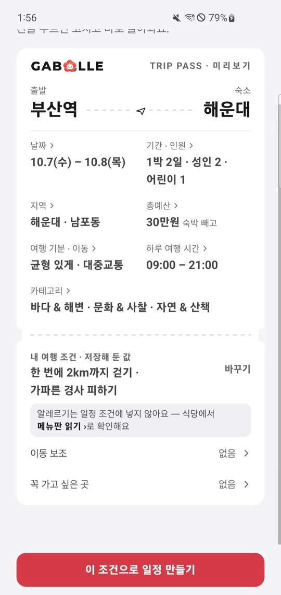
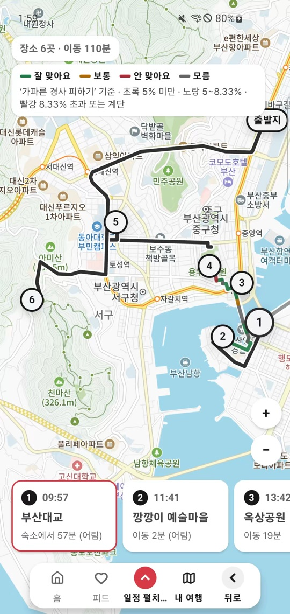
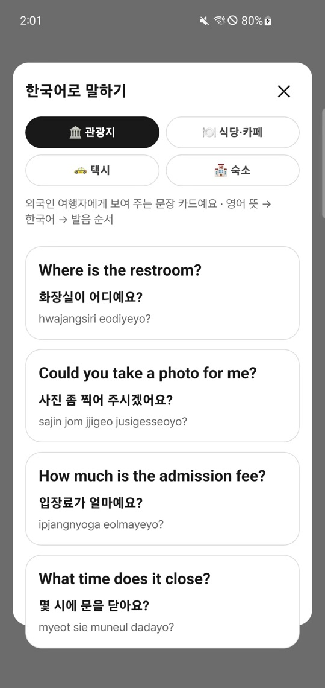
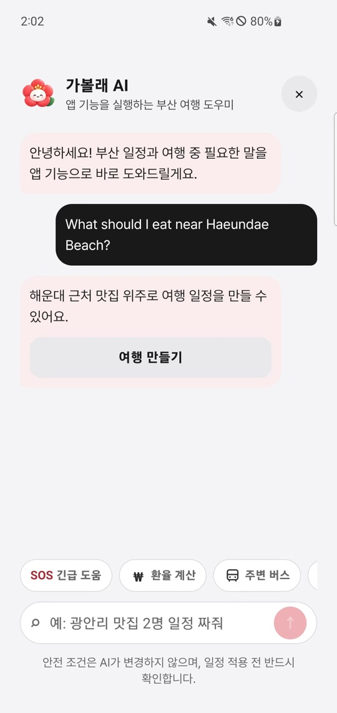

# 가볼래 (GABOLLE)

> 부산의 모든 여행, 가볼래?

SSAFY 15기 자율 프로젝트 · 부울경 E201 · 6인 팀

가볼래는 외국인 관광객이 부산 여행을 계획하고 현장에서 쓸 수 있도록 만든 서비스입니다. 날짜와 동행 인원, 출발지, 예산, 이동 방식, 취향을 입력하면 장소와 일정을 볼 수 있습니다. 걷는 거리와 경사도 여행 조건에 넣었습니다.

여행지를 찾고 이동 순서를 다시 짜는 번거로움을 줄이려고 시작했습니다. 서비스 화면과 제가 맡은 백엔드 작업을 각각 소개합니다.

## 사용 흐름

1. 홈에서 부산의 여행 기록과 축제를 둘러보고, 관심 있는 장소를 후보에 담습니다.
2. 날짜·인원·출발지·숙소·교통수단·예산을 정한 뒤 여행 취향과 이동 조건을 확인합니다.
3. 추천 코스를 고르면 장소 순서와 이동 시간이 들어간 일정이 만들어집니다.
4. 일정표와 지도에서 경로를 확인하고, 여행 중에는 현장 도구와 AI 도우미를 이용합니다.

아래 이미지는 모두 `가볼래_시연.mp4`의 **앱 화면을 직접 캡처**한 것입니다. 원본 영상은 용량 때문에 저장소에 넣지 않았습니다. 설계 문서에는 시연 영상에 나오지 않는 기능도 있습니다.

## 주요 화면

| 홈 · 여행 시작 | 장소 상세 · 이동 정보 | 부산 축제 |
|:---:|:---:|:---:|
|  |  |  |

홈에서 여행을 만들거나 여행 기록과 축제를 둘러볼 수 있습니다. 장소 상세에는 주소와 경사·계단 정보가 나옵니다. 확인되지 않은 항목은 **미확인**으로 표시합니다.

| 여행 기본 정보 | 취향 선택 | 조건 확인 |
|:---:|:---:|:---:|
|  |  |  |

여행 만들기에서는 날짜와 인원, 출발지·숙소, 교통수단, 여행 시간, 예산을 차례로 입력합니다. 취향은 건너뛸 수 있지만, 안전·식단·이동 제약은 별도의 조건으로 다룹니다. 마지막 *트립 패스*에서 입력값을 다시 보고 수정한 뒤 일정을 생성합니다.

| 일정 지도 | 현장에서 쓰는 한국어 | 가볼래 AI |
|:---:|:---:|:---:|
|  |  |  |

지도에는 장소 순서와 예상 이동 시간, 구간별 경사 적합도가 나옵니다. 여행 중에는 한국어 문장 카드와 환율 계산, 주변 버스, 긴급 도움 도구를 바로 열 수 있습니다.

### 영상 속 AI 도우미

시연 영상에서 해운대 근처 음식을 묻자 가볼래 AI는 맛집 위주로 일정을 만들 수 있다고 답하고 `여행 만들기` 버튼을 띄웁니다. 특정 식당을 추천하지는 않습니다.

화면 흐름과 이동·식단 조건의 기준은 [가볼래 팀 공유 문서](docs/gabolle/README.md)의 확정 v1.1 명세를 따릅니다. 명세에 있는 모든 기능이 위 시연 영상에서 동작하는 것은 아닙니다.

## 기술 구성

| 영역 | 사용 기술 |
|---|---|
| 앱 | Expo · React Native · TypeScript · Expo Router |
| 서버 | Spring Boot · Java 17 · Spring Security |
| 저장소 | PostgreSQL · Spring Data JPA · Flyway |
| 데이터·추천 | Python · 장소/이동 데이터 가공 · 일정 추천 |
| 운영 | Docker Compose · Jenkins · Nginx |

앱 코드는 `frontend/`, 서버 코드는 `backend/`, 장소·교통·지형 데이터 작업은 `bigData/`에 있습니다. 서버는 여행 조건과 장소·일정 데이터를 관리하고, 추천 영역은 후보 선택과 동선 계산을 맡습니다. 기능별 실제 구현과 실행 조건은 각 폴더의 README를 확인해 주세요.

## 담당 역할과 주요 기여

저는 6인 팀에서 여행·일정 기능의 백엔드 개발, PostgreSQL 저장·검증, AI 여행 도우미 서버 기능을 맡았습니다. 화면과 추천 기능은 팀원들이 함께 개발했습니다.

| 담당 | 구현·검증한 내용 |
|---|---|
| 여행 생성 | 같은 요청이 재전송돼도 여행이 중복 생성되지 않도록 요청 키와 본문 지문을 저장 |
| 일정 저장 | 동행자가 같은 일정을 동시에 고칠 때 판 번호와 최신 판 갱신을 DB에서 검증 |
| DB 안정화 | 실제 PostgreSQL 통합 테스트에서 발견한 충돌·트랜잭션 문제 수정 |
| 이벤트 수집 | 메모리 저장소를 참조하던 경로를 찾아 DB 저장 경로로 통합 |
| AI 도우미 | 답변 범위를 앱 기능 안내로 좁히고, 실시간 정보는 전용 화면으로 연결하도록 서버 로직 구성 |

### 1. 같은 여행이 여러 번 만들어지던 문제

모바일에서 응답이 끊겨 생성 요청을 다시 보내면 여행이 중복될 수 있습니다. 처음에는 “키가 있나 조회 → 여행 생성 → 키 등록” 순서였는데, 동시에 들어온 요청들이 모두 조회를 통과할 수 있었습니다.

요청 키를 **먼저 확보한 요청만** 여행을 만들도록 바꿨습니다. PostgreSQL의 `UNIQUE (user_id, idempotency_key)`는 같은 사용자의 같은 키를 한 번만 받는 제약이고, `ON CONFLICT DO NOTHING`은 이미 키가 있을 때 오류 대신 저장을 건너뜁니다. 같은 키·같은 내용의 재요청에는 기존 여행을 돌려주고, 같은 키·다른 내용에는 충돌을 반환합니다. 이런 식으로 재시도해도 결과가 하나로 유지되는 성질을 **멱등성**이라고 합니다.

[여행 생성 서비스](backend/src/main/java/com/gabolle/backend/trip/application/TripCreationService.java) · [PostgreSQL 저장 코드](backend/src/main/java/com/gabolle/backend/trip/infra/JpaTripRepository.java) · [동시 요청 테스트](backend/src/test/java/com/gabolle/backend/trip/TripCreationTest.java) · [DB 통합 테스트](backend/src/test/java/com/gabolle/backend/trip/TripPersistenceIntegrationTest.java)

### 2. 동행자의 일정 수정이 서로 덮어쓸 수 있던 문제

두 사람이 모두 일정 5번 판을 열어 수정했다면, 먼저 저장한 사람의 6번 판을 나중 요청이 조용히 덮어써서는 안 됩니다. 서버에서 최신 판을 읽어 확인하는 것만으로는 확인과 저장 사이에 다른 요청이 끼어들 수 있었습니다.

수정 요청에 바탕 판 번호(`baseVersion`)를 넣고, 저장할 때도 `(itinerary_id, version)`의 중복을 막았습니다. 최신 판 번호를 바꾸는 쿼리는 여전히 그 번호가 `baseVersion`일 때만 실행합니다. 충돌한 요청은 HTTP 409(현재 상태와 충돌해 저장하지 않았다는 응답)로 돌려줍니다.

[8개 동시 요청 테스트](backend/src/test/java/com/gabolle/backend/itinerary/ItineraryVersionConflictTest.java)는 메모리 저장소에서 실행합니다. 5번 판을 바탕으로 1개만 성공하고 7개가 거절되며, 7번 판이 생기지 않는지 확인합니다. 별도의 [PostgreSQL 통합 테스트](backend/src/test/java/com/gabolle/backend/itinerary/ItineraryPersistenceIntegrationTest.java)에서는 중복 판과 최신 판 갱신 충돌이 실제 DB에서도 거절되는지 검증합니다. 8개 동시 요청 테스트를 PostgreSQL에서 실행한 결과는 아닙니다.

[일정 저장 코드](backend/src/main/java/com/gabolle/backend/itinerary/infra/JpaItineraryRepository.java)

### 3. 충돌을 처리하다 트랜잭션 전체가 실패한 문제

일정 판의 중복 저장을 처음에는 DB 오류로 감지하고 `SAVEPOINT`(트랜잭션 안에서 일부 작업만 되돌리는 지점)로 복구하려 했습니다. 하지만 실제 PostgreSQL을 쓰는 통합 테스트에서는 중첩 트랜잭션을 지원하지 않는다는 예외가 났습니다.

그래서 중복 판의 `INSERT`에 `ON CONFLICT DO NOTHING`을 적용했습니다. 충돌이 나도 SQL 오류를 만들지 않고, 저장된 행 수가 0이면 충돌로 처리합니다. 최신 판 번호 역시 조건부 `UPDATE`로 바꿔, 판 번호의 중복과 최신 판의 잘못된 이동을 각각 막았습니다.

[충돌 처리 코드](backend/src/main/java/com/gabolle/backend/itinerary/infra/JpaItineraryRepository.java) · [실제 DB 검증](backend/src/test/java/com/gabolle/backend/itinerary/ItineraryPersistenceIntegrationTest.java)

### 4. 이벤트가 서버 재시작 뒤 사라진 문제

이벤트 수집 요청은 성공했지만, 서비스가 DB 저장소 대신 메모리 저장소 인터페이스를 참조하고 있었습니다. 서버를 끄면 기록도 사라졌습니다. 참조 경로를 추적해 이벤트 수집을 **Outbox**(업무 데이터와 이벤트를 같은 DB에 먼저 기록해 두는 방식) 저장 경로로 통합했습니다. 제가 맡은 부분은 수집 경로를 찾아 수정한 작업이며, Outbox 전체 설계는 팀 작업입니다.

[이벤트 수집 서비스](backend/src/main/java/com/gabolle/backend/event/application/EventIngestService.java) · [저장 서비스](backend/src/main/java/com/gabolle/backend/event/application/OutboxService.java)

### AI 도우미에서 정한 범위

생성형 AI가 존재하지 않는 장소를 안내하거나 환율·버스 도착시간을 지어내면 실제 여행에 영향을 줍니다. 그래서 도우미는 장소를 확정하는 대신 여행 만들기와 현장 도구로 연결하도록 범위를 좁혔습니다. 서버에서 이동 가능한 화면 주소를 정해 두고, 목록 밖의 주소를 생성하면 안내 응답으로 낮춥니다. 여행 조건은 사용자가 적용 전에 확인합니다. 시연 화면의 해운대 음식 질문도 특정 식당 추천이 아니라 `여행 만들기`로 이어집니다.

AI 서버 코드는 팀의 `back/dev` 브랜치에 있습니다. 이 GitHub `main`에는 아직 포함되지 않아, 여기에는 시연 화면과 팀 브랜치에서 확인한 내용만 적었습니다.

## 로컬 실행

프론트엔드는 Node.js 20 이상이 필요합니다.

```bash
cd frontend
cp .env.example .env
npm install
npm run web
```

백엔드는 Java 17과 Docker가 필요합니다. `.env`의 비밀번호와 비밀키를 설정한 뒤 실행합니다.

```bash
cd backend
cp .env.example .env
docker compose up --build -d
```

환경변수와 OAuth 설정은 [백엔드 실행 안내](backend/README.md)를 참고해 주세요. 비밀값은 저장소에 올리지 않습니다.

## 기획·설계 문서

[`docs/gabolle`](docs/gabolle/README.md)에 있는 v1.1 문서 6종이 팀의 확정 기준입니다. `.docx`가 원본이며, 아래 내용은 그 문서와 시연 영상을 대조해 작성했습니다.

- [통합 서비스 기획서](docs/gabolle/GABOLLE_통합_서비스_기획서_v1.1.docx) · 문제 정의와 서비스 범위
- [요구사항 명세서](docs/gabolle/GABOLLE_요구사항_명세서_v1.1.docx) · 기능별 요구사항
- [API 명세서](docs/gabolle/GABOLLE_API_명세서_v1.1.docx) · 앱과 서버의 요청·응답 계약
- [도메인 온톨로지 명세서](docs/gabolle/GABOLLE_도메인_온톨로지_명세서_v1.1.docx) · 장소와 제약의 판정 기준
- [화면 흐름·정보 구조 명세서](docs/gabolle/GABOLLE_화면흐름_및_정보구조_명세서_v1.1.docx) · 화면과 이동 흐름
- [사용자 시나리오·인수 기준](docs/gabolle/GABOLLE_사용자_시나리오_및_인수기준_v1.1.docx) · 완료 판정 기준

## 팀

박재현 · 이예승 · 장효준 · 고지혁 · 모진성 · 진미리

SSAFY 팀 프로젝트입니다. 라이선스는 [LICENSE](LICENSE)를 참고해 주세요.
