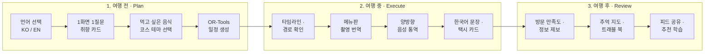
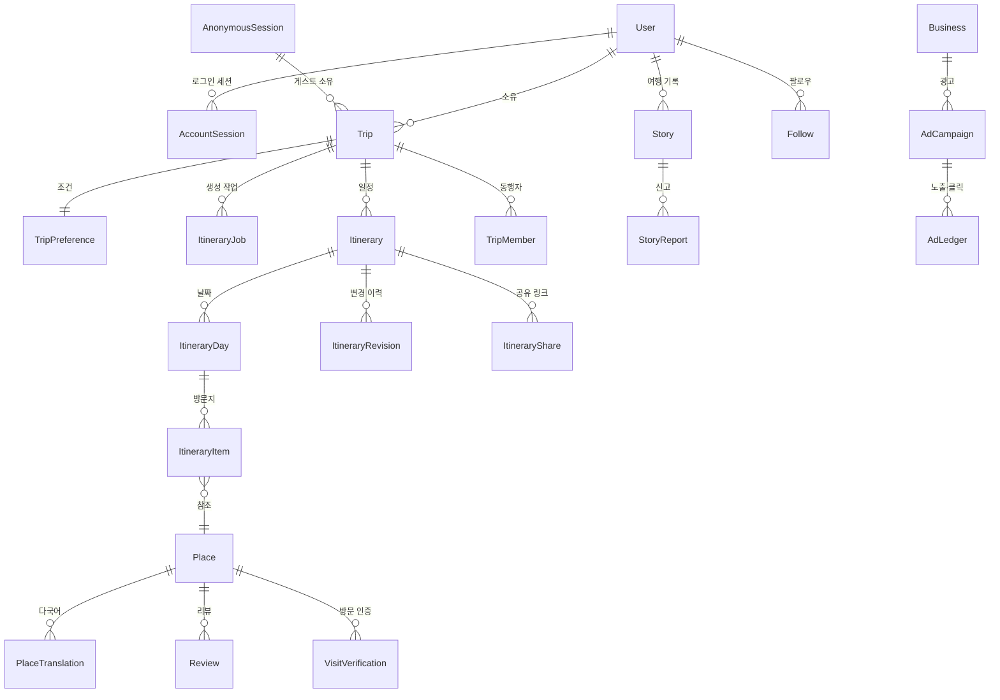

# LOCAL ROUTE 통합 서비스 기획서 v7.0

**부제** — 현지인이 다시 가는 곳으로, 언어와 지도의 장벽 없이

| 항목 | 내용 |
| --- | --- |
| 문서 버전 | **v7.0** |
| 최종 개정일 | 2026-08-27 (목) |
| 이전 버전 | v6.0 — **제품 설계는 그대로 두고, 스택에 매달린 서술만 고쳤다** |
| 팀 체제 | 6인 (BE · ML · DB · FE · APP · INFRA) |
| 이 문서가 다루는 것 | **무엇을 만드나** — 기능 · 데이터 · 원칙 · 품질 규격 |
| 이 문서가 안 다루는 것 | **누가 언제 어떻게 만드나** — `LOCAL_ROUTE_실행계획_v7.md` 에 있다 |
| 짝 문서 | `LOCAL_ROUTE_실행계획_v7.md` (실행) · `LOCAL_ROUTE_상세설계서_v2.md` (화면) |

---

## 문서 표기 규칙

이 문서는 **검증된 것과 아직 아닌 것을 구분해서** 적는다. 청사진이 사실과 다르면 그것을 믿고 일한 사람의 시간이 사라진다.

| 표기 | 의미 |
| --- | --- |
| **[실측]** | 2026-08-26 기준 저장소 코드·개발 DB를 직접 세어 확인한 값 |
| **[확정 사실]** | 공식 문서로 확인. 출처와 확인일을 함께 적는다 |
| **[데모]** | 지금은 동작하는 것처럼 보이지만 실제로는 가짜이거나 임시인 부분 |
| **[구현 필요]** | 아직 존재하지 않는다. 만들어야 한다 |
| **[가설]** | 검증되지 않은 수치·판단. 실측 전까지 의사결정 근거로 쓰지 않는다 |
| **[위험]** | 놓치면 일정이나 출시를 막는다 |

---

## 🔴 v6 → v7 — 무엇이 바뀌었고, 무엇이 안 바뀌었나

**v6 이 틀려서 고친 것이 아니다.** v6 이 쓰인 뒤 팀이 스택을 정했고,
그 결정이 v6 의 **전제**를 바꿔 놓았다.

### 안 바뀐 것 — 이 문서의 대부분이다

| | 왜 안 바뀌나 |
| --- | --- |
| 12대 핵심 기능 명세 (6장) | **무엇을 만드는가는 무엇으로 만드는가와 무관하다** |
| 6대 원칙 (2장) · 페르소나 (3장) | 같다 |
| 데이터 모델의 **설계** (8장) | 테이블이 무엇이고 무엇과 이어지는가는 그대로다. 적는 문법만 바뀐다 |
| **데이터 결측 실측** (5.2절) | 영문주소 0% · 알레르기 0%. **데이터는 스택과 무관하다.** 그대로 유효한 숙제다 |
| 데이터 신뢰 정책 (13장) | 이 서비스가 다른 여행 앱과 다르다고 말하는 근거 |
| 품질 규격 — 다국어 · 접근성 (12장) | 같다 |

### 바뀐 것

| 구분 | v6 | v7 | 왜 |
| --- | --- | --- | --- |
| **백엔드** | Node · Express · Prisma | **Spring Boot · JPA** | 팀 결정 — 실행계획 2.2절에 근거 |
| **DB** | PostgreSQL 16 | **MySQL** | 위와 같다 |
| **프론트** | 기존 데모 UI 를 손본다 | **처음부터 만든다** | 기획 판단 |
| **디자인 토큰** | 색상 값을 표로 박아 뒀다 | **값을 적지 않는다** | 그 값은 **버릴 데모 UI 에서 뽑은 것**이다. 디자인 시스템은 아직 [미정] |
| **현재 상태 서술** | "화면 44개 중 23개 완료 · API 66개 동작" | **전부 0에서 시작** | 그 숫자는 참고 코드(`ref/local-route`)를 잰 것인데, 그 코드는 안 쓴다 |
| **5장의 성격** | "우리 코드의 데모 감사" | **"참고 코드에서 배운 것"** | 우리 코드가 아직 없으므로 |
| **일정 · 역할 · 브랜치 · 리뷰** | 이 문서와 짝 계획서에 흩어져 있었다 | **`LOCAL_ROUTE_실행계획_v7.md` 로 모았다** | 스택이 바뀌면 통째로 바뀌는 부분이라 한 곳에 둔다 |
| **스토어 출시** | 목표로 전제하고 상세히 다뤘다 | **목표인지부터 [미정]** | 확인된 적이 없다. 실행계획 8.3절 |

### 🔴 이 문서를 읽을 때 조심할 것

v6 은 **"이미 만들어져 있다"** 는 서술이 많았다. 그 서술의 대상은
**참고 코드(`ref/local-route`)** 였고, **우리가 만들 코드가 아니다.**

그래서 v7 은 표기를 하나 바꾼다.

| v6 표기 | v7 표기 | 뜻 |
| --- | --- | --- |
| `[구현됨]` | **`[견본 있음]`** | 참고 코드에 이미 만들어진 예가 있다. **우리는 아직 안 만들었다** |
| `[데모]` | `[견본도 가짜]` | 참고 코드에서조차 진짜가 아니었다. **그대로 베끼면 안 된다** |
| `[구현 필요]` | 그대로 | 견본에도 없다. 설계부터 해야 한다 |

**`[견본 있음]` 은 "다 됐다"가 아니라 "어떻게 생겨야 하는지 볼 데가 있다"는 뜻이다.**

---

## 목차

1. Executive Summary
2. 서비스 정의와 6대 원칙
3. 타깃 사용자와 페르소나
4. 여행 3단계 사용자 여정
5. **현재 구현 실측과 데모 감사**
6. 12대 핵심 기능 명세
7. 추천 및 동선 최적화 알고리즘
8. 데이터 모델 (26개)
9. API 명세 (66개)
10. 화면 구조 (44개 페이지 트리)
11. 마일스톤과 실제 출시 일정
12. 품질 규격 — 반응형 · 다국어 · 접근성
13. 데이터 신뢰 정책
14. 6인 팀 역할 요약
15. KPI
16. 리스크 관리
17. 부록

---

## 1. Executive Summary

### 1.1 한 문장 정의

> **LOCAL ROUTE**는 현지인이 실제로 다시 찾는 장소를 근거로, 외국인 여행자가 한국에서 겪는 **탐색 · 이동 · 주문 · 소통의 단절을 해소**하고, 제약조건 최적화 엔진이 계산한 **실행 가능한 시간표**와 현장에서 바로 쓰는 **한국어 도구**를 제공하는 로컬 여행 동행 서비스다.

### 1.2 지금 어디까지 와 있는가 [실측 · 2026-08-27]

**우리가 만든 제품 코드는 아직 없다.** 있는 것은 **참고 코드**와 **데이터**와 **설계**다.
이걸 흐리게 적으면 계획이 통째로 어긋나므로 분명히 갈라서 적는다.

| 영역 | 우리 코드 | 참고 코드(`ref/local-route`)에는 |
| --- | :-: | --- |
| 백엔드 (Spring) | **0** | Express 로 만든 API 견본이 있다 |
| 웹 (React) | **0** | 화면 견본이 있다. **디자인을 새로 하므로 코드는 안 쓴다** |
| 앱 | **0** | 없다 |
| 배포 | **0** | 로컬 실행 설정만 |

| 영역 | 상태 | 비고 |
| --- | --- | --- |
| **최적화 엔진** | ✅ **쓸 수 있다** | Python OR-Tools 솔버. **서버와 따로 도는 별개 프로세스**라 부르는 쪽만 바꾸면 된다 |
| **장소 데이터** | ✅ **쓸 수 있다** | 277곳. 다만 **영문명 15% · 영문주소 0% · 알레르기 0%** — 5.2절 |
| **설계** | ✅ **쓸 수 있다** | 이 문서와 짝 문서 둘. 기능 명세와 화면 설계가 이미 한 번 검증됐다 |

> **즉 출발점은 "절반쯤 만들어진 서비스"가 아니라 "잘 그려진 설계도 + 엔진 하나 + 데이터"다.**
>
> 이게 나쁜 소식만은 아니다. 보통 프로젝트가 첫 주에 태우는 것이
> **"무엇을 만들지 정하는 시간"** 인데, 우리는 그게 이미 끝나 있다.
> 기능 65개와 화면 44개가 **누가 한 번 만들어 보고 정리한 결과**로 적혀 있다.

**남은 일은 넷이다.**

1. **세운다** — Spring · React · 배포 경로. 빈 것이 배포까지 도는 상태를 먼저 만든다
2. **옮긴다** — 장소 데이터 277곳을 MySQL 로
3. **만든다** — 설계도에 있는 것을 한 줄기씩 세로로 관통시킨다
4. **채운다** — 영문주소 0% · 알레르기 0%. **코드가 아니라 사람 손이 드는 일이다**

> 🔴 **4번을 과소평가하지 않는다.** v6 이 찾아낸 것 중 가장 값나가는 발견이 이것이다 —
> **남은 일의 상당 부분이 코드가 아니다.** 자세한 것은 5.2절.

### 1.3 해결하려는 문제

| 외국인 여행자가 겪는 단절 | LOCAL ROUTE의 해법 | 현재 상태 |
| --- | --- | --- |
| 구글맵이 한국 대중교통·도보 길찾기를 제대로 못 한다 | 카카오 모빌리티 연동 경로 안내 | 견본 있음 |
| 메뉴를 읽지 못해 주문을 못 한다 | 카메라 메뉴판 번역 + 알레르기 배지 | **[데모]** 수작업 사전 113개 |
| 말이 통하지 않아 요청을 못 한다 | 양방향 음성 통역 + 장소별 한국어 문장 | **[데모]** if-else 분기 |
| 알레르기·식단 정보를 확인할 수 없다 | 메뉴별 원재료 분석과 경보 | **[데모]** 데이터 0% |
| 동선이 비효율적이라 하루가 무너진다 | OR-Tools 시간창 제약 최적화 | ✅ **엔진을 그대로 쓴다** |
| 광고성 정보와 진짜 로컬을 구분할 수 없다 | 로컬 점수와 광고의 완전 분리 | 견본 있음 (**코드로 강제하는 방식**을 그대로 가져간다) |

### 1.4 지금 당장 결정해야 하는 것

**제품에 관한 결정만 여기 둔다.** 스택·브랜치·역할·일정 결정은
`LOCAL_ROUTE_실행계획_v7.md` 10.1절에 모아 뒀다.

| # | 결정 | 왜 지금인가 |
| --- | --- | --- |
| 1 | **스토어 출시를 목표에 넣나** | 이 하나가 남은 일의 3분의 1을 정한다. 넣는다면 계정 개설이 **당장** 시작돼야 한다 — 승인 대기는 팀이 통제할 수 없다. **실행계획 8.3절** |
| 2 | **앱 v1 범위** — 웹 화면을 다 옮기지 않는다 | 앱에 필요한 화면이 약 40개인데, 그걸 다 만들려다 크래시가 남으면 **급한 앱이 오히려 출시를 늦춘다**. 11.4절 |
| 3 | 메뉴 OCR · 번역 · 음성을 **어느 외부 서비스로 할지** | **계약·키 발급에 시간이 걸린다.** 코드보다 대기시간이 길다 |
| 4 | **소셜 로그인을 넣지 않는다**는 판단 유지 | 넣는 순간 심사 요건이 하나 늘어난다. 9.4절 |
| 5 | **디자인 시스템** | 화면을 몇 개 그린 뒤에 바꾸면 그린 것을 다시 그린다. 실행계획 2.6절 |

> 🔴 **1번은 되돌리기가 비대칭이다.** "넣기로 했다가 빼는 것"은 그냥 안 하면 되지만,
> **"뺐다가 나중에 넣는 것"** 은 스토어 계정 승인 대기와 비공개 테스트 기간이
> 그때부터 시작된다. **애매하면 계정 개설만이라도 먼저 해 두는 쪽이 싸다.**

---

## 2. 서비스 정의와 6대 원칙

### 2.1 6대 원칙

1. **검증된 데이터와 제약조건 최적화가 결정한다.**
   일정의 장소 조합과 시간표는 생성형 AI가 아니라 추천 점수와 OR-Tools 최적화기가 정한다. LLM은 번역과 의도 해석만 담당한다. 운영시간·이동시간·예산 제약을 만족하지 않는 일정은 만들지 않는다.

2. **유명세보다 현장 실행 가능성이 먼저다.**
   영어 메뉴 유무, 해외카드 결제, 브레이크타임, 혼밥 가능 여부처럼 **실제로 들어갈 수 있는가**를 우선 검증한다.

3. **안전 정보는 모르면 모른다고 말한다.**
   알레르기·식단 정보가 확인되지 않은 장소는 안전하다고 추정하지 않는다. 화면에 `확인 필요`로 표시한다. 이 원칙은 데이터가 없을 때 특히 중요하다.

4. **광고비는 추천 순위에 개입하지 못한다.**
   광고는 자연 추천과 UI에서 분리하고 `광고` 라벨을 붙인다. 음식점·카페·기념품샵 업종은 API 단계에서 광고 등록을 거부한다. 이건 정책이 아니라 코드다.

5. **언어 전환은 즉시, 전 화면에서 일어난다.**
   우측 상단 스위처를 누르면 새로고침 없이 모든 텍스트가 바뀐다. 장소명은 `해운대 해수욕장 (Haeundae Beach)` 형태로 병기해 현장 표지판과 대조할 수 있게 한다.

6. **한 사람의 여행이 끝까지 완결되는 것을 우선한다.**
   기능을 늘리는 것보다 `음식 선택 → 일정 생성 → 현장 이동 → 주문 → 기록`이 한 번 끊김 없이 되는 것이 먼저다.

### 2.2 🔴 원칙은 문서가 아니라 코드로 지킨다

**원칙을 문서에만 적어 두면 지켜지지 않는다.** 바쁠 때 제일 먼저 잊히는 것이 원칙이다.
그래서 **각 원칙마다 "어디서 강제할 것인가"를 미리 정한다.**

참고 코드가 이걸 어떻게 했는지 볼 수 있으므로, **견본 자리와 우리가 만들 자리를 함께 적는다.**

| 원칙 | 견본은 어디서 강제했나 | 우리는 어디서 강제하나 |
| --- | --- | --- |
| 1 (최적화가 정한다) | 시간창 제약 스케줄러 + OR-Tools 솔버 | 서버의 일정 생성 서비스 + **같은 솔버** (그대로 쓴다) |
| 2 (현장 실행 가능성) | 장소의 영어메뉴·해외카드 칼럼 | **같은 칼럼** — 8장 |
| 3 (모르면 모른다) | 장소 카드에서 알레르기 데이터가 없으면 경고를 띄우는 분기 | **화면 컴포넌트에서 같은 분기.** 13.2절 |
| 4 (광고는 순위에 개입 못 한다) | 추천 점수식에 광고 항이 아예 없다 + 업종 화이트리스트를 API 가 거부 | **같다** — 13.1절 |
| 5 (언어 전환 즉시) | 다국어 사전 + 장소 번역 테이블 | **같다** — 12.2절 |
| 6 (한 사람의 여행이 완결) | 화면 정의를 한 파일에 모아 여정 순서로 둔다 | **같은 방식** — 10장 |

> 🔴 **원칙 4가 특히 중요하다.** *"광고비는 추천 순위에 개입하지 못한다"* 는
> 정책 문장이 아니라 **점수 계산식에 광고 항을 안 넣는 것**으로 지켜진다.
> 정책은 바뀔 수 있고 식은 리뷰를 지나야 바뀐다. **그래서 식에 둔다.**

---

## 3. 타깃 사용자와 페르소나

### 3.1 Emily — 28세, 미국인, 초행 뚜벅이

| 항목 | 내용 |
| --- | --- |
| 상황 | 한국 첫 방문. 한글을 읽지 못한다. 3박 4일 부산 |
| 제약 | 돼지고기를 먹지 못한다. 매운 것에 약하다. 렌터카 없음 |
| 두려움 | 메뉴판 앞에서 아무것도 못 고르는 상황. 택시에서 목적지를 설명하지 못하는 상황 |
| 필요 | 밀면·돼지국밥 중 먹을 수 있는 것 구분, 메뉴판 촬영 확인, 기사에게 보여줄 한국어 주소 |
| 주 사용 기능 | 음식 칩 선택 · 메뉴판 번역 · 음성 통역 · 택시 카드 |
| **v6에서 이 사람을 위해 반드시 채워야 할 것** | **영문 장소명·영문 주소 (현재 15% / 0%)**, 알레르기 데이터 (현재 0%) |

### 3.2 켄타 — 32세, 일본인, 맛집 탐방 재방문객

| 항목 | 내용 |
| --- | --- |
| 상황 | 부산 3회차. 해운대는 이미 가봤다 |
| 필요 | 전포동 카페거리, 영도 노포처럼 현지인이 실제로 가는 곳. 이동 시간 최소화 |
| 두려움 | 블로그 광고에 속아 시간을 버리는 것 |
| 주 사용 기능 | 로컬 코스 모드 · 10개 코스 테마 · 카카오 후기 카드 |
| **반드시 채워야 할 것** | **카카오 평점·후기 데이터 (현재 0%)** — 이게 없으면 "진짜 로컬"을 증명할 근거가 없다 |

### 3.3 지은 — 26세, 한국인, 주말 여행자 [v6 신설]

| 항목 | 내용 |
| --- | --- |
| 상황 | 서울 거주. 금요일 밤 출발 2박 3일 |
| 필요 | 짧은 시간에 알찬 동선. 예산 안에서 후회 없는 선택 |
| 주 사용 기능 | 코스 테마(갓성비·인생샷) · 동행자 공동 편집 · 트래블 북 |
| 왜 넣었나 | 초기 사용자의 상당수는 국내 여행자다. 외국인 기능이 완성되기 전에도 서비스가 돌아가려면 이 사람이 쓸 수 있어야 한다 |

---

## 4. 여행 3단계 사용자 여정



### 4.1 여정 단계와 화면 매핑

| 단계 | 화면 경로 | 견본 상태 |
| --- | --- | --- |
| 언어 선택·소개 | `/welcome` | 완료 |
| 로그인·회원가입 | `/auth/login` `/auth/signup` | 완료 |
| 취향 입력 | `/plan/basic` `/plan/taste` `/plan/conditions` `/plan/confirm` | 완료 |
| 일정 생성 | `/generating/:tripId` | 완료 |
| 여행 요약 | `/trips/:tripId/overview` | 완료 |
| 일정·동선 | `/trips/:tripId/schedule` `/schedule/:dayIndex` | 완료 |
| 경로 상세·내비 | `/trips/:tripId/scheduleNavigate` | 완료 |
| 지도 전체 | `/trips/:tripId/map` | 부분 |
| 로컬 탐색 | `/trips/:tripId/discover` (+ festivals · souvenirs) | 완료 / 부분 |
| 현장 도구 | 모달 (메뉴판 · 음성 · 사투리 · 한국어 말하기) | **데모** |
| 기록 | `/stories` `/stories/new` | 완료 |
| 여행 준비 | `/trips/:tripId/prep` | 완료 |
| 내 여행 | `/me/trips` `/me/settings` | 완료 |
| 약관·정책 | `/legal/*` | **예정** |
| 운영 콘솔 | `/admin/*` | **예정** |

---

## 5. 참고 코드에서 배운 것과 데이터 실측

**청사진은 도착지만 그리면 안 되고 출발지를 정확히 적어야 한다.**

이 장은 v6 에서 "데모 감사" 라는 이름으로 생겼다. v7 에서 이름이 바뀐 이유는
**대상이 바뀌었기 때문**이다 — v6 은 *우리 코드*를 감사한다고 썼지만, 실제로 잰 것은
**참고 코드(`ref/local-route`)** 였다. 그 코드는 이제 안 쓴다.

**그래도 이 장은 살아 있다.** 이유가 둘이다.

1. **데이터는 그대로 쓴다.** 5.2절의 결측 실측은 **스택과 무관하게 그대로 유효한 숙제**다
2. **견본이 어디서 거짓말했는지는 우리가 그 자리에서 거짓말하지 않기 위한 목록이다.**
   견본을 보고 만들다 보면 **가짜인 부분까지 그대로 베끼게 된다**

### 5.1 견본의 규모가 알려주는 것 [실측]

**이 표는 "우리가 가진 것"이 아니라 "이만큼이 필요하더라"는 견적이다.**

| 영역 | 견본 규모 | 이게 우리에게 알려주는 것 |
| --- | --- | --- |
| API 엔드포인트 | **66개** | 이 서비스가 성립하려면 서버 기능이 이 정도 필요했다. **Spring 으로 다시 만든다** |
| 데이터 모델 | **26개** | 테이블 설계의 크기. 8장에 목록이 있다 |
| 화면 | **44개** | 10장에 목록이 있다 |
| Python 솔버 | 1개 | ✅ **이것만은 그대로 가져다 쓴다** |

> 🔴 **줄 수를 이 문서에 적지 않는다.** v6 은 파일별 줄 수를 표로 적어 뒀는데,
> **그 숫자는 우리 코드가 아니고 앞으로도 아닐 것**이다. 적어 두면 다음 사람이
> **그만큼이 이미 만들어져 있다고 읽는다.** 그게 v6 이 실제로 일으킨 오해다.

**대신 "무엇이 얼마나 어렵더라"만 남긴다.**

| 무거웠던 자리 | 왜 무거웠나 |
| --- | --- |
| **여행·일정·장소·경로** 를 다루는 API 묶음 | 한 곳에 기능이 몰린다. **여기를 한 사람이 다 쥐면 병목이 된다** |
| **시간창 제약 스케줄링** | 운영시간·체류시간·이동시간을 동시에 만족시키는 것이 본질적으로 어렵다 |
| **카카오 연동** (로컬·모빌리티·좌표) | 외부 API 라 실패 경로가 많다. **폴백을 먼저 설계해야 한다** |
| **부분 재최적화** | 되돌리기·고정·제외가 얽힌다 |

> **이 네 자리가 이 프로젝트에서 사람이 오래 붙을 곳이다.** 일을 나눌 때
> 이 넷을 한 사람에게 몰지 않는다.

### 5.2 데이터 커버리지 [실측이지만 **재현 불가**]

> 🔴 **2026-08-27 — 이 절의 숫자는 다시 잴 수 없다.**
>
> 이 표를 잰 개발 DB 가 **지금 어디 있는지 아무도 모른다.** 작성자(이예승)에게
> 확인했고 답은 이랬다 — *"`ref/local-route` 작업 당시 로컬에 있던 dev DB인데
> 지금 바로 위치를 못 짚겠습니다. 찾으면 알려드리겠습니다."*
>
> **틀렸다는 뜻이 아니다.** 잰 사람이 실제로 잰 값이고, 반증도 못 한다.
> 다만 **확인하고 싶은 사람이 확인할 방법이 지금 없다.** 그래서 `[실측]` 이 아니라
> `[실측이지만 재현 불가]` 로 적는다 — 표기가 실제보다 세면 다음 사람이
> 검증된 값으로 읽는다.
>
> **일에는 이렇게 쓴다.** 결측을 채우는 것은 여전히 해야 할 일이고 우선순위도 그대로다.
> 다만 **"영문주소 0%" 같은 수치를 완료 기준(예: "0% → 80%")으로 걸지 않는다.**
> 시작점을 못 재면 끝점도 못 잰다. DB 를 우리 MySQL 로 옮긴 뒤 **거기서 다시 세고,
> 그 숫자를 기준으로 삼는다.**

| 테이블 | 행 수 |
| --- | ---: |
| `Place` | **277** |
| `Trip` | 125 |
| `Itinerary` | 377 |
| `PlaceTranslation` | **36** |
| `AdCampaign` | 8 (전부 데모) |
| `Business` | 2 |
| `BookingPartner` | 1 (가짜 링크) |
| `Review` | 1 |
| `User` | 1 |
| `VisitVerification` | 1 |
| `Story` | 0 |
| `Follow` | 0 |

**장소 277곳의 필드 결측률 [실측이지만 재현 불가]** — 이것이 v6의 가장 중요한 발견이다.

| 필드 | 채워짐 | 비율 | 이 필드가 없으면 무엇이 안 되나 |
| --- | ---: | ---: | --- |
| `imageUrl` | 269/277 | 97% | (양호) |
| `contentId` | 233/277 | 84% | (양호) |
| `closedDays` | 55/277 | 20% | 휴무일에 일정이 잡힌다 |
| `nameEn` | 42/277 | **15%** | 영어 모드에서 장소 이름이 한글로 나온다 |
| `nightImageUrl` | 5/277 | 2% | 야경 코스 사진이 없다 |
| `playTime` · `souvenirItems` · 행사 기간 | 3/277 | 1% | 액티비티·기념품 카드가 비어 보인다 |
| `addressEn` | 0/277 | **0%** | **택시 카드·영문 주소 기능이 성립하지 않는다** |
| `allergens` | 0/277 | **0%** | **원칙 3(안전 정보)이 데이터로 뒷받침되지 않는다** |
| `dietOptions` | 0/277 | **0%** | 채식·할랄 여행자가 쓸 수 없다 |
| `kakaoRating` 등 리뷰 6종 | 0/277 | **0%** | **"검증된 카카오 리뷰 기반"이라는 서비스 정의가 성립하지 않는다** |
| `localScoreUpdatedAt` | 0/277 | 0% | 로컬 점수의 신선도를 알 수 없다 |

> **[위험] 서비스 정체성이 데이터로 뒷받침되지 않는다.**
> 기획서는 "외국인 대상"과 "카카오 리뷰 검증"을 핵심으로 내세우는데, 영문 주소가 0%이고 카카오 평점이 0%다. **코드를 아무리 잘 만들어도 이 두 칸이 비어 있으면 데모다.** 그래서 v6는 DB 담당의 1순위 목표를 "장소 추가"가 아니라 "결측 채우기"로 바꿨다.

### 5.3 견본 감사 — 21건

#### A. 🔴 견본에서도 가짜였던 것 (7건) — **베끼면 안 되는 자리**

**이 목록이 v7 에서 가장 실용적인 부분이다.** 견본을 보고 만들다 보면
**동작하는 것처럼 보이는 가짜까지 그대로 옮기게 된다.** 화면에서는 똑같이 보이기 때문에
**옮긴 사람도 그게 가짜인 줄 모른다.**

| ID | 항목 | 견본은 어떻게 했나 | **우리는 어떻게 해야 하나** |
| --- | --- | --- | --- |
| **D-1** | 날씨 예보 | 날짜 문자열의 **문자코드 합**으로 기온·강수확률을 지어냈다 | 기상청 예보를 부른다. **못 부르면 "예보 없음"** — 지어내지 않는다 |
| **D-2** | 웹 날씨 위젯 | 서버 값조차 안 쓰고 3일치를 화면에 박아 뒀다 | 서버 값을 쓴다. **두 겹으로 가짜였던 자리다** |
| **D-3** | 음성 통역 | *"pork 이라는 글자가 들어 있으면 이 문장을 낸다"* 식 분기. **번역이 아니다** | 실제 번역 서비스를 부른다. 실패하면 **미리 준비한 문장만** 주고 그 사실을 표시한다 |
| **D-4** | 메뉴판 번역 | 브라우저 안에서 글자를 읽고, 사람이 손으로 적은 사전 113개로만 번역 | 클라우드 인식으로 바꾸고 사전을 넓힌다. 6.5절 |
| **D-5** | 스토리 이미지 | 사진을 **글자로 바꿔 데이터베이스 안에 통째로** 넣었다 | **파일 저장소에 넣는다.** DB 에 사진을 넣으면 사용자가 늘 때 DB 가 먼저 죽는다 |
| **D-6** | 예약 제휴 | 존재하지 않는 예시 주소로 연결 | **실제 제휴가 없으면 예약 영역을 숨긴다.** 가짜 링크를 노출하지 않는다 |
| **D-7** | 광고 캠페인 | 데모 8건이 **실제 광고처럼** 노출 | 실제 광고주가 없으면 **광고 영역을 숨긴다** |

> 🔴 **여기 있는 것들의 공통점 하나** — 전부 **"없는 것을 있는 것처럼 보이게" 한 것**이다.
> 이 서비스가 스스로 내건 원칙 3(*"모르면 모른다고 말한다"*)과 정면으로 어긋난다.
> **없으면 숨기거나 모른다고 적는다.** 그게 이 목록 전체의 답이다.

#### B. 데이터가 비어 있는 것 (7건)

| ID | 항목 | 현재 [실측] | 목표 |
| --- | --- | --- | --- |
| **D-8** | 영문 장소명 | 15% | **100%** |
| **D-9** | 영문 주소 | 0% | **100%** |
| **D-10** | 알레르기 | 0% | **식당·카페 100%** (모르면 `확인 필요`) |
| **D-11** | 식단 옵션 | 0% | 식당·카페 100% |
| **D-12** | 휴무일 | 20% | **80%** |
| **D-13** | 카카오 평점·후기 | 0% | 식당 상위 50곳 |
| **D-14** | 구조화 번역 | 36행 | 277곳 전체 |

#### C. 운영·보안 (7건) — **처음부터 제대로 세울 자리**

우리는 0에서 시작하므로 이건 **"고칠 것"이 아니라 "처음부터 안 틀릴 것"** 이다.
**견본이 여기서 미뤘다가 나중에 비싸진 자리들**이라 목록의 값이 그대로 있다.

| ID | 항목 | 견본에서 무슨 일이 있었나 | 우리가 처음부터 할 것 |
| --- | --- | --- | --- |
| **D-15** | 데이터베이스 | 파일 하나짜리 DB 로 시작했다가 나중에 옮겨야 했다 | **처음부터 MySQL** |
| **D-16** | 배포 | 로컬 실행만 있었다 | **껍데기 단계에서 배포 경로부터 만든다.** 실행계획 8.4절 |
| **D-17** | 관리자 토큰 | 설정을 안 하면 **추측 가능한 기본값**이 쓰였다 → 관리자 API 가 무방비 | 🔴 **기본값을 두지 않는다.** 설정이 없으면 **뜨지 않게** 한다 |
| **D-18** | 예약 서명 키 | 위와 같다 (기본값 `change-before-production`) | 위와 같다 |
| **D-19** | 이메일 인증 | 생략. 아무 이메일로나 가입되고 비밀번호 재설정이 없었다 | 재설정 경로는 만든다. 인증 메일은 나중으로 미룰 수 있다 |
| **D-20** | 계정 삭제 | **없었다** | **앱을 낸다면 필수다.** 9.3절 |
| **D-21** | 이미지 검색 키 | 없어서 사진 없는 장소는 자리표시 이미지 | 키를 넣거나, 자리표시로 간다고 **정하고 적는다** |

> 🔴 **D-17 · D-18 이 이 목록에서 제일 중요하다.** *"설정이 없으면 기본값을 쓴다"* 는
> 편의가 **보안 구멍을 조용히 만든다.** 아무도 오류를 못 보니까 아무도 안 고친다.
>
> **그래서 규칙을 하나 정한다 — 비밀 값에는 기본값을 두지 않는다.**
> 설정이 없으면 서버가 **안 뜨는 쪽**이 맞다. 안 뜨면 5분 안에 고쳐지고,
> 기본값으로 뜨면 몇 달을 간다.

#### 🟢 견본이 잘한 것 — 그대로 따라 할 것

**감사가 지적 위주가 되면 배울 것을 놓친다.** 아래는 견본이 제대로 한 자리다.

| 무엇 | 왜 좋았나 | 우리가 할 것 |
| --- | --- | --- |
| **비밀번호 저장** | 계정마다 다른 소금값(salt) + 비교 시간이 일정한 검사 | **Spring Security 의 표준 방식**으로 같은 수준을 확보한다. **직접 구현하지 않는다** |
| **보안 기본값** | 보안 헤더 · 허용 출처 목록 · 요청 횟수 제한이 다 붙어 있었다 | 같은 셋을 처음부터 켠다 |
| **광고 분리** | 정책이 아니라 **API 가 거부**하는 방식으로 강제 | 그대로 |
| **추정값 표기** | 이동시간이 실제 응답이 아닐 때 **"추정"으로 구분**해서 내려보냈다 | **그대로.** 원칙 3이 코드에 사는 방식의 좋은 예다 |
| **화면 정의를 한 파일에** | 화면 44개가 한 곳에 여정 순서로 정의돼 있었다 | 같은 방식. 10장 |

### 5.4 전환 항목 분포

| 분류 | 건수 | 성격 | 병목 |
| --- | ---: | --- | --- |
| 코드 가짜 | 7 | 외부 서비스로 교체 | **계약·키 발급 시간** |
| 데이터 결측 | 7 | 콘텐츠 채우기 | **사람 손. 자동화해도 검수가 남는다** |
| 운영·보안 | 7 | 인프라·설정 | 배포와 시크릿 |

**남은 일의 절반 이상이 코드가 아니다.** 이 사실이 6인 역할 배분의 근거다(14장).

---

## 6. 12대 핵심 기능 명세

각 기능을 **현재 상태 → 실서비스 요건 → 수용 기준 → 담당 → 마감** 순으로 적는다. 수용 기준은 "됐다"를 누가 봐도 같게 판정할 수 있게 쓴다.

---

### 6.1 온보딩과 전역 언어 스위처 (KO / EN)

| 구분 | 내용 |
| --- | --- |
| **현재** | **[견본 있음]** 언어 스위처와 다국어 사전이 동작하는 예가 있다 |
| **문제** | 장소명 병기가 `nameEn` 데이터에 의존하는데 **85%가 비어 있다.** 영어 모드에서 한글 이름이 그대로 노출된다 |
| **실서비스 요건** | ① 우측 상단 고정 스위처 ② 전환 시 새로고침 없이 즉시 리렌더 ③ 장소명 `한글 (English)` 병기 ④ 오류 메시지·모달·지도 팝업까지 전부 전환 |
| **수용 기준** | 영어 모드로 전체 화면을 돌았을 때 **한글이 남아 있는 곳 0건**. 미번역 문자열 탐지 스크립트가 0을 반환 |
| **담당** | FE (화면) · DB (번역 데이터) |
| **마감** | 웹 단계 |

---

### 6.2 1화면 1질문 취향 카드 위저드

| 구분 | 내용 |
| --- | --- |
| **현재** | **[견본 있음]** 한 화면에 한 질문씩 넘기는 카드 방식으로 만들어진 예가 있다 |
| **실서비스 요건** | ① 여행 기분 ② 선호 활동 ③ 식단·알레르기 ④ 예산·인원·기간 ⑤ 뒤로가기와 새로고침에도 입력이 유지 |
| **수용 기준** | 375px 화면에서 각 단계가 세로 스크롤 1회 이내. 중간에 새로고침해도 입력값 보존 |
| **담당** | FE |
| **마감** | 웹 단계 |

---

### 6.3 먹고 싶은 한국 음식 8종 칩 · 일정 앵커링

| 구분 | 내용 |
| --- | --- |
| **현재** | **[견본 있음]** 음식 칩 선택과 추천 가산점 반영까지 되어 있다 |
| **8종** | 밀면 · 돼지국밥 · 씨앗호떡 · 회·해산물 · 동래파전 · 복국 · 부산어묵 · 낙곱새 |
| **문제** | 선택한 음식을 파는 식당을 식별하려면 장소에 메뉴 태그가 있어야 하는데, 현재는 `tasteTags` 추정에 의존한다 |
| **실서비스 요건** | ① 음식별 영문명·발음·맵기·주요 원재료·가격대 ② 해당 음식 판매 식당을 점심·저녁 슬롯에 우선 배정 ③ **먹지 못하는 재료(돼지고기 등)를 고른 사용자에게는 그 음식을 추천하지 않는다** |
| **수용 기준** | 8종 각각에 대해 **판매 식당이 최소 5곳** 태깅되어 있고, 선택 시 해당 식당이 식사 슬롯에 배정된다. 돼지고기 제외 설정 시 돼지국밥이 추천되지 않는다 |
| **담당** | DB (음식-식당 태깅) · ML (가산점 로직) |
| **마감** | 웹 단계 |

---

### 6.4 10개 코스 테마

| 코드 | 이름 |
| --- | --- |
| `ZERO_WON` | 무일푼 0원 코스 |
| `BEST_BANG` | 갓성비 알뜰 코스 |
| `SPLURGE` | 럭셔리 호캉스·파인다이닝 |
| `OLD_TOWN` | 구수한 골목길·원도심 |
| `NATURE_FIX` | 자연인 힐링 바다·숲길 |
| `PICTURE_PERFECT` | 인생샷·야경 명소 |
| `EASY_PACE` | 여유로운 뚜벅이 |
| `FAMILY_CARE` | 가족 안심 코스 |
| `SOLO_FRIENDLY` | 혼밥·혼행 안심 |
| `RAINY_DAY` | 비 오는 날 실내 감성 |

| 구분 | 내용 |
| --- | --- |
| **현재** | **[견본 있음]** 테마 10종 정의와 테마별 가중치 배수가 설정 파일로 분리돼 있다 |
| **문제** | `SOLO_FRIENDLY`를 판정할 **`soloFriendly` 컬럼이 스키마에 없다.** `RAINY_DAY`는 `isOutdoor`로 판정 가능하나 데이터가 부족하다 |
| **실서비스 요건** | 10개 테마 각각에 대해 후보 장소가 **하루 일정을 채울 만큼**(최소 15곳) 존재해야 한다 |
| **수용 기준** | 테마별로 2박 3일 일정을 생성했을 때 **동일 장소 반복 0건**, 테마 성격과 맞지 않는 장소 0건 |
| **담당** | DB (칼럼 추가 + 태깅) · ML (가중치) |
| **마감** | 웹 단계 · 🔴 `soloFriendly` 칼럼은 **데이터 적재 전에** 추가한다 (8.4절) |

---

### 6.5 카메라 메뉴판 OCR 번역 [데모 → 실서비스]

| 구분 | 내용 |
| --- | --- |
| **현재** | 🔴 **[견본도 가짜]** 브라우저 안에서 글자를 읽고, **사람이 손으로 적은 사전 113개**로만 번역했다. 사전에 없는 메뉴는 번역되지 않는다. **그대로 베끼면 안 되는 자리다** |
| **문제** | 한글 메뉴판은 폰트·조명·기울기 변화가 커서 Tesseract 정확도가 낮다. 사전 113개로는 실제 메뉴판을 감당할 수 없다 |
| **실서비스 요건** | ① 클라우드 OCR로 교체 (후보: Google Cloud Vision · Naver CLOVA OCR — **착수 전에 선택**) ② 메뉴명·가격 구조화 추출 ③ **부산 대표 메뉴 300종 사전 + 8대 알레르기 원재료 매핑** ④ 맵기 단계 배지 ⑤ 메뉴명 TTS |
| **폴백** | 네트워크 실패·쿼터 초과 시 기존 온디바이스 경로로 자동 전환하고 화면에 "간이 인식" 표시 |
| **수용 기준** | 부산 대표 메뉴 **50종 실사진 테스트에서 메뉴명 인식 80% 이상**, 가격 인식 70% 이상. 측정 스크립트를 저장소에 둔다 |
| **비용 관리** | 사용자당 일 10회 제한 · 결과 24시간 캐시 |
| **담당** | ML (파이프라인·사전) · BE (중계 API·사용량 제한) · APP (네이티브 카메라) |
| **마감** | 웹 단계 → 앱 단계 |

> **[위험] 이 기능은 외부 계약이 필요하다 — 코드보다 대기시간이 길다.** 제공자를 정하고 키를 받지 못하면 이 기능만 간이로 남는다. 그 경우 화면에 **"간이 인식"임을 정직하게 표시한다.** 되는 척하지 않는다.

---

### 6.6 양방향 실시간 음성 통역 [데모 → 실서비스]

| 구분 | 내용 |
| --- | --- |
| **현재** | 🔴 **[견본도 가짜]** *"pork 이라는 글자가 있으면 이 문장을 낸다"* 식 분기로 미리 정한 문장만 반환했다. **번역이 아니다** |
| **실서비스 요건** | ① 실제 번역 API 연동 (후보: Papago · DeepL · Google Translate — **착수 전에 선택**) ② STT는 브라우저·네이티브 음성 인식 ③ TTS 재생 ④ 워키토키 UI (Tourist / Local 버튼) ⑤ 자주 쓰는 문장 프리셋 |
| **폴백** | 음성 인식 실패 시 **텍스트 입력으로 전환**. 번역 API 실패 시 프리셋 문장만 제공하고 그 사실을 표시 |
| **수용 기준** | STT → 번역 → TTS 왕복 **3초 이하**. 실패 시 흰 화면이 아니라 폴백 UI가 뜬다. 프리셋 12문장은 네트워크 없이도 동작 |
| **담당** | ML (파이프라인) · BE (중계) · APP (네이티브 음성) |
| **마감** | 웹 단계 → 앱 단계 |

---

### 6.7 부산 사투리 표현 위젯

| 구분 | 내용 |
| --- | --- |
| **현재** | **[견본 있음]** 여행 준비 탭에 사투리 위젯이 있다 |
| **표현** | 가가 가가? · 맞나? · 단디해라 · 억수로 좋네! · 살아있네! · 밥 먹었나? 외 |
| **실서비스 요건** | ① 표현별 뉘앙스·사용 상황 해설 ② TTS 재생 ③ 플래시카드 확대 보기 ④ 영문 의미 병기 |
| **수용 기준** | 8종 전부에 한글·영문·상황 해설·TTS가 있다 |
| **담당** | FE · DB (콘텐츠) |
| **마감** | 웹 단계 |

---

### 6.8 장소별 한국어 말하기 모달 (4대 탭)

| 구분 | 내용 |
| --- | --- |
| **현재** | **[견본 있음]** 4개 탭과 상황별 문장 생성이 되어 있다 |
| **4대 탭** | 관광지 · 식당·카페 · 택시 · 숙소 |
| **실서비스 요건** | ① 상황별 문장 최소 14종 ② 대형 텍스트(현장에서 보여주기) ③ 한국어 발음 표기 ④ 일반·천천히 TTS ⑤ **장소 데이터의 한국어 주소를 그대로 사용** |
| **문제** | 택시 탭의 주소 카드가 `addressEn` 없이도 동작하지만, 반대로 **영어 사용자에게 보여줄 영문 주소가 0%**라 "여기가 어디인지" 본인이 확인할 수 없다 |
| **수용 기준** | 4개 탭 각각에서 문장 재생·복사·확대가 동작. 택시 카드에 한국어 주소와 영문 주소가 함께 표시 |
| **담당** | FE · DB (영문 주소) |
| **마감** | 웹 단계 |

---

### 6.9 카카오 평점·후기 연동과 예상 비용 [데이터 결측]

| 구분 | 내용 |
| --- | --- |
| **현재** | **[견본 있음]** 화면은 만들어져 있었다. 🔴 **그런데 데이터가 0% 라 아무것도 안 나온다** — 코드가 아니라 데이터가 문제인 대표 사례다 |
| **제약 [확정 사실]** | 카카오 로컬 API 응답에는 평점·후기 필드가 없다. 임의 크롤링은 하지 않는다 |
| **실서비스 요건** | ① **권한이 확인된 집계 데이터만** 적재한다 (임의 수집은 하지 않는다) ② 출처(`LICENSED_IMPORT` 또는 `MANUAL_VERIFIED`)와 수집일 표시 ③ 후기 수 30건·평균 4.0을 사전값으로 둔 베이지안 보정 ④ 집계가 없으면 **추천 점수에 반영하지 않고 화면에도 표시하지 않는다** |
| **비용 산출** | 무료 관광지 0원 · 유료 관람 15,000원 · 식당 1인 14,000원 · 카페 7,000원 · 숙소 80,000~150,000원을 기준값으로 하되 **화면에 "추정"으로 명시** |
| **수용 기준** | 식당 상위 50곳에 평점 데이터가 있고, 없는 곳은 카드가 아예 나타나지 않는다(빈 별점 금지) |
| **담당** | DB (수집·적재) · ML (보정 로직) |
| **마감** | 웹 단계 |

> **[위험] 이 항목은 데이터 확보 경로가 팀 외부에 있다.** 확보하지 못하면 서비스 정의에서 **"카카오 리뷰 검증"을 빼고** "현지인 방문 기반 로컬 점수"만 남겨야 한다. **없는 것을 있다고 말하지 않는다.**

---

### 6.10 날씨 연동과 실내 대체 제안 [데모 → 실서비스]

| 구분 | 내용 |
| --- | --- |
| **현재** | 🔴 **[견본도 가짜]** 서버는 날짜 문자열의 문자코드로 값을 지어냈고, 화면 위젯은 그 서버 값조차 안 쓰고 3일치를 박아 뒀다. **두 겹으로 가짜였다** |
| **실서비스 요건** | ① 기상청 단기예보 API 연동 ② 날짜별 기온·강수확률·하늘 상태 ③ 1시간 캐시 ④ 우천 시 우산 준비물 안내 ⑤ 야외 장소를 실내로 1클릭 교체 (부분 재최적화 재사용) |
| **수용 기준** | `WeatherPrepWidget`의 하드코딩 배열이 제거되고 API 값을 쓴다. API 실패 시 위젯이 숨겨지거나 "예보 없음"을 표시한다. **가짜 값을 보여주지 않는다** |
| **담당** | BE (기상청 연동) · FE (위젯 교체) |
| **마감** | 웹 단계 |

---

### 6.11 현장 이동 지원과 택시 목적지 카드

| 구분 | 내용 |
| --- | --- |
| **현재** | **[견본 있음]** 택시 카드 API 와 경로 상세·내비 화면이 있다 |
| **실서비스 요건** | ① 지하철역·출구 번호, 버스 번호 ② 기사에게 보여줄 전체 화면 한국어 주소 카드 ③ 클립보드 복사 ④ 카카오맵·구글맵 딥링크 |
| **문제** | 지하철 출구 번호 등 세부 정보가 장소 데이터에 없다 |
| **수용 기준** | 임의의 장소 10곳에서 택시 카드가 한국어 주소와 함께 정상 표시. 딥링크가 양 OS에서 지도 앱을 연다 |
| **담당** | BE · APP |
| **마감** | 웹 단계 → 앱 단계 |

---

### 6.12 트래블 북과 추억 지도

| 구분 | 내용 |
| --- | --- |
| **현재** | **[견본 있음]** 기록 모델과 추억 요약 화면이 있다 |
| **문제 [데모]** | 사진을 **base64로 DB에 저장**한다. 사용자가 늘면 DB가 감당하지 못한다 |
| **실서비스 요건** | ① 오브젝트 스토리지 업로드로 교체 ② 업로드 전 리사이즈 ③ **EXIF 제거** ④ 위치는 지역 단위로만 저장 ⑤ 여행 종료 후 지연 공개 기본값 ⑥ 방문 경로 폴리라인과 사진 결합 |
| **수용 기준** | 새 스토리 이미지가 DB가 아닌 스토리지에 저장된다. 기존 base64 데이터 마이그레이션 스크립트가 있다. 업로드한 사진의 EXIF에 GPS가 남지 않는다 |
| **담당** | INFRA (파일 저장소) · BE (업로드 API) · FE·APP (업로드 화면) |
| **마감** | 웹 단계 |

---

## 7. 추천 및 동선 최적화 알고리즘

### 7.1 다기준 추천 점수

점수는 다음 축의 가중 합으로 계산한다.

```
Score = w1·TasteMatch      (취향 태그 일치)
      + w2·LocalScore      (현지인 재방문 기반 로컬 점수)
      + w3·TravelEfficiency(이동 효율)
      + w4·BudgetFit       (예산 적합도)
      + w5·ForeignerEase   (외국인 현장 이용 편의)
      + w6·PetFit          (v6에서 미사용 · 0 처리)
      + w7·Freshness       (정보 신선도)
      + DesiredFoodBonus   (선택한 음식 판매 식당 가산점)
      - LandmarkPenalty    (코스 테마별 관광지 페널티)
```

- 가중치는 **코스 테마별로 배수 조정**된다 (`config/course_categories.json`의 `weightMultipliers`).
- `DesiredFoodBonus`는 사용자가 고른 8종 음식을 파는 식당에 부여한다.
- **광고비는 이 식에 들어가지 않는다.** 원칙 4의 구현 지점이다.

### 7.2 로컬 점수 산출

| 입력 | 처리 |
| --- | --- |
| 방문 인증(`VisitVerification`) | GPS 검증된 실제 방문만 집계 |
| 리뷰(`Review`) | 방문 인증을 거친 리뷰만 반영 |
| 카카오 평점·후기 | 권한 확인된 집계만. **후기 30건·평균 4.0을 사전값으로 둔 베이지안 보정**으로 소수 후기의 극단값을 완화 |
| 신선도 | `localScoreUpdatedAt` 기준. 오래된 점수는 신뢰도를 낮춘다 |

> **[실측] 현재 방문 인증 1건, 리뷰 1건, 카카오 데이터 0건.** 로컬 점수는 지금 시드 값에 의존한다. 실사용 데이터가 쌓이기 전까지는 이 한계를 화면에 정직하게 표시한다.

### 7.3 권역 군집화와 시간창 스케줄링

- 부산을 3대 권역으로 나눠 하루 동선이 흩어지지 않게 한다: **동부산**(해운대·기장) · **중부산**(서면·전포) · **서부산**(남포·영도).
- 하루 안에서 권역을 넘나들 때 **거리 제곱 페널티**를 부과한다.
- 스케줄러가 **운영시간·체류시간·이동시간·식사 슬롯** 제약을 동시에 만족하는 시간표를 만든다. 🔴 **견본에서 가장 무거웠던 부분이다** (5.1절).

### 7.4 OR-Tools 솔버 [실측]

| 항목 | 값 |
| --- | --- |
| 위치 | `server/solver/route_optimizer.py` (118줄) |
| 버전 | `ortools==9.14.6206` |
| 호출 | 서버가 **Python 프로세스를 실행**해서 결과를 받는다. 🔴 **Spring 에서도 같은 방식** — 솔버 코드는 안 건드린다 |
| 폴백 | 솔버 실패·타임아웃 시 TypeScript 휴리스틱 스케줄러로 자동 전환 |
| CI | GitHub Actions에서 `pip install -r server/requirements-optimizer.txt` 후 테스트 |

**성능 목표 [가설 → 측정 필요]**

v5는 "이동시간 35% 단축"을 단정했으나 근거가 없었다. v6은 다음으로 대체한다.

- 동일 조건 10개 시나리오에 대해 **최적화 적용 / 미적용**의 총 이동시간을 측정하고 **결과를 그대로 기록**한다.
- 목표치를 미리 정하지 않는다. 측정 결과가 기대에 못 미치면 그것이 개선 과제가 된다.
- 측정 스크립트를 저장소에 두고, **결과를 그대로 기록한다.**

### 7.5 부분 재최적화

사용자가 장소를 고정·제외·교체하면 **그 날짜만** 다시 계산한다. 고정 장소와 다른 날짜는 유지된다.

| 동작 | 엔드포인트 |
| --- | --- |
| 고정·제외·교체 | `POST /api/itineraries/:id/days/:dayIndex/reoptimize` |
| 날짜 재계획 | `POST /api/itineraries/:id/days/:dayIndex/replan` |
| 순서 변경 | `PATCH /api/itineraries/:id/days/:dayIndex/reorder` |
| 되돌리기 | `POST /api/itineraries/:id/undo` (`ItineraryRevision` 기반) |
| 대체 후보 | `GET /api/itineraries/:id/items/:itemId/alternatives` |

### 7.6 페이스 학습

사용자의 실제 이동 속도를 학습해 다음 일정의 이동 시간 추정에 반영한다.

| 엔드포인트 | 역할 |
| --- | --- |
| `POST /api/itineraries/:id/items/:itemId/progress` | 실제 도착·이동 기록 |
| `GET /api/itineraries/:id/pace` | 지연 위험 항목과 예상 도착 시각 |
| `GET /api/trips/:tripId/rhythm` | 여행 리듬 브리핑 |

---

## 8. 데이터 모델 — 26개

> **이 장은 설계이지 문법이 아니다.** 테이블이 무엇이고 무엇과 이어지는가는
> Node 든 Spring 이든 PostgreSQL 이든 MySQL 이든 **그대로다.** 바뀌는 것은
> 그것을 적는 방법뿐이다 — Prisma 스키마 대신 **JPA 엔티티**(Java 에서 테이블을
> 객체로 다루는 표준 방식), PostgreSQL 대신 **MySQL**.
>
> 🔴 **옮길 때 실제로 깨지는 자리**(문자 집합 · 시각 · JSON 칼럼 · 인덱스 길이)는
> `LOCAL_ROUTE_실행계획_v7.md` 6.2절에 따로 정리해 뒀다. **옮기기 전에 그걸 먼저 읽는다.**

### 8.1 모델 목록

v5의 ERD는 `TRIP_DAY`·`TRIP_STORY`·`PLACE_REVIEW` 같은 존재하지 않는 이름을 썼다.
아래가 견본에서 실제로 쓰인 이름이고, **이 설계를 그대로 가져간다.**

| 도메인 | 모델 |
| --- | --- |
| 장소·콘텐츠 | `Place` · `PlaceTranslation` |
| 여행·일정 | `Trip` · `TripPreference` · `ItineraryJob` · `Itinerary` · `ItineraryDay` · `ItineraryItem` · `ItineraryRevision` |
| 계정·세션 | `User` · `AccountSession` · `AnonymousSession` |
| 검증·평판 | `VisitVerification` · `Review` · `LocalProfile` |
| 협업·공유 | `TripMember` · `ItineraryShare` |
| 소셜 | `Story` · `StoryReport` · `Follow` |
| 커머스 | `Business` · `AdCampaign` · `AdLedger` · `BookingPartner` · `BookingRecord` |
| 시스템 | `EventOutbox` |

### 8.2 핵심 관계



### 8.3 `Place` 주요 컬럼 [실측 · 42개 컬럼]

| 그룹 | 컬럼 | 현재 채움률 |
| --- | --- | --- |
| 기본 | `nameKo` `category` `address` `lat` `lng` | 100% |
| 다국어 | `nameEn` · `addressEn` | **15% · 0%** |
| 운영 | `openTime` `closeTime` `closedDays` `recommendedStayMin` | 100% · 100% · **20%** · 100% |
| 비용 | `priceTier` | 100% |
| 외국인 편의 | `hasEnglishMenu` `foreignCardPayment` `foreignAssistance` | 100% |
| 안전 | `allergens` · `dietOptions` | **0% · 0%** |
| 평판 | `localScore` `localScoreSource` `localScoreUpdatedAt` | 100% · 100% · **0%** |
| 카카오 | `kakaoPlaceId` `kakaoRating` `kakaoReviewCount` 외 4종 | **전부 0%** |
| 이미지 | `imageUrl` · `nightImageUrl` | 97% · 2% |
| 분류 | `tasteTags` `isOutdoor` `playTime` `souvenirItems` | 100% · 100% · 1% · 1% |
| 출처 | `dataSource` `contentId` | 100% · 84% |

### 8.4 추가할 컬럼 [구현 필요]

**스택이 바뀌어도 이 판단은 그대로 유효하다.** "이 기능을 하려면 이 값이 필요하다"는
말은 무엇으로 만드는지와 무관하다.

| 컬럼 | 없으면 무엇이 안 되나 |
| --- | --- |
| `soloFriendly` (참/거짓) | 코스 테마 `SOLO_FRIENDLY`(혼밥·혼행 안심)를 **판정할 근거가 없다.** 테마가 이름만 있고 내용이 없어진다. 원칙 2의 "혼밥 가능 여부"도 같다 |
| `breakTime` (문자열) | 브레이크타임에 식사 일정이 잡힌다. **가서 문이 닫혀 있다** |
| `lastOrderTime` (문자열) | 라스트오더 지나서 도착한다 |
| `subwayExit` (문자열) | 지하철 출구 번호가 없어 현장 안내가 반쪽이 된다 (6.11 요건) |

**추가로 검토할 것 [제안]**

| 무엇 | 왜 |
| --- | --- |
| 사용자의 **자주 쓰는 출발지**를 저장하는 자리 | 이동시간 캐시가 출발지 기준으로 도는데, 출발지가 매번 새 좌표면 캐시가 안 맞는다. `LOCAL_ROUTE_실행계획_v7.md` 7.3절 |
| `PasswordResetToken` | 비밀번호 재설정 경로가 없다 (9.3절) |

> 🔴 **칼럼은 지금 정하는 것이 가장 싸다.** 데이터가 쌓인 뒤에 칼럼을 추가하면
> **기존 행을 전부 채우는 일**이 따라온다. 지금은 표 한 줄이다.
>
> **담당·마감: `LOCAL_ROUTE_실행계획_v7.md` 6.3절.** 이 문서에 날짜를 적지 않는다 —
> 두 곳에 적으면 한쪽이 반드시 낡는다.

### 8.5 인덱스 설계 [설계 제안]

| 테이블 | 인덱스 | 이유 |
| --- | --- | --- |
| `Place` | `(category, isActive)` | 추천 1단계 후보 조회 |
| `Place` | `(lat, lng)` 복합 | 근접 검색 바운딩 박스 |
| `Place` | `(localScore DESC)` | 상위 정렬 |
| `ItineraryItem` | `(itineraryDayId, sortOrder)` | 일자별 정렬 |
| `ItineraryDay` | `(itineraryId, dayIndex)` | 일자 조회 |
| `Trip` | `(userId, createdAt DESC)` | 내 여행 목록 |
| `Story` | `(publishedAt DESC)` 부분 인덱스 | 피드 |
| `EventOutbox` | 미발행 부분 인덱스 | 이벤트 디스패처 |

**공간 검색용 전용 확장은 도입하지 않는다.** 장소가 277곳~수천 곳 규모다.
이 규모에서는 **위도·경도의 최소·최대로 네모 상자를 만들어 후보를 좁힌 뒤,
좁혀진 것만 하버사인**(지구가 둥근 것을 고려한 두 점 사이 거리 공식)**으로 정렬**하면
충분하다. `(위도, 경도)` 복합 인덱스가 그 네모 상자 조회에 쓰인다.

필요해지는 시점은 **"수십만 건에서 반경 검색이 느려질 때"** 이고, 그때 다시 본다.
지금 도입하면 설치·학습 비용만 들고 값을 못 한다.

> **v6 문서가 이 자리에서 스스로 어긋나 있었다** — 한쪽에서는 전용 확장을 쓴다고 하고
> 다른 쪽에서는 하버사인 + 복합 인덱스를 쓴다고 했다. **둘 중 하나로 정한다.**

---

## 9. API 명세 — 66개

> **여기 적힌 66개는 "이미 있는 것"이 아니라 "이 서비스가 성립하려면 필요한 것"이다.**
> 견본에서 실제로 이만큼이 필요했다. **Spring 으로 다시 만든다.**

### 9.1 도메인별 분포

v6 은 이 표를 **파일 이름**으로 적었다. 파일 이름은 스택이 바뀌면 없어지므로,
v7 은 **도메인**(무엇에 관한 것인가)으로 적는다. **도메인은 안 바뀐다.**

| 도메인 | 개수 | 주 담당 | 대표 경로 |
| --- | ---: | :-: | --- |
| **여행 · 일정 · 장소 · 경로** | **23** | BE · ML 공동 | `/trips` `/trips/:id/itinerary` `/places` `/routes/directions` |
| 소셜 (기록 · 팔로우 · 신고) | 9 | BE | `/stories` `/users/:id/follow` `/moderation/*` |
| 커머스 (광고 · 예약) | 8 | BE | `/ads` `/bookings/*` `/businesses/*` |
| 협업 · 공유 | 7 | BE | `/itineraries/:id/share` `/s/:slug` `/collaboration/invites/*` |
| 계정 · 세션 | 5 | BE | `/auth/register` `/auth/login` `/auth/me` `/auth/logout` |
| 커뮤니티 (리뷰 · 방문 인증) | 5 | BE | `/places/:id/reviews` `/places/:id/visits/verify` |
| 경험 (축제 · 기념품 · 날씨) | 5 | ML · BE | `/festivals` `/events` `/shops/souvenir` `/weather` |
| 분석 | 3 | BE | `/analytics/kpis` `/events` |
| 상태 확인 | 1 | INFRA | `/health` |
| **합계** | **66** | | |

### 9.2 🔴 첫 번째 줄이 제일 무겁다 — 한 사람에게 몰지 않는다

**여행·일정·장소·경로 하나에 23개가 몰려 있다.** 전체의 3분의 1이 넘는다.
견본에서도 이 부분이 한 파일에 몰려 있었고, 그래서 두 사람이 함께 썼다.

**우리도 여기를 갈라야 한다.** 갈래는 이렇게 생겼다.

| 갈래 | 주 담당 | 대표 경로 |
| --- | :-: | --- |
| 여행 생성 · 조회 · 설정 | BE | `POST /trips` · `GET /trips` · `GET /trips/:id/itinerary` |
| 생성 작업 · 진행률 스트림 | BE | `POST /trips/:id/itineraries:generate` · 진행 이벤트 |
| 재최적화 · 재계획 · 순서 · 되돌리기 | **ML** | `/reoptimize` · `/replan` · `/reorder` · `/undo` |
| 추천 부가 | **ML** | `/alternatives` · `/course-categories` · `/pace` · `/rhythm` |
| 장소 · 경로 · 검색 | **ML** | `/places` · `/locations/search` · `/routes/directions` · `/routes/taxi-card` |

> **한 사람이 둘 이상의 갈래를 동시에 쥐지 않게 한다.** 그리고 이 영역을 고칠 때는
> **다른 갈래 담당을 리뷰어로 넣는다.** 한 도메인을 둘이 쓰는 유일한 자리다.
>
> **일을 어떻게 나눌지는** `LOCAL_ROUTE_실행계획_v7.md` 5.5절의 제안(기능 단위로 붙기)을 본다.

### 9.3 추가할 API [구현 필요]

**견본에도 없던 것들이다.** 설계부터 해야 한다.

| 엔드포인트 | 왜 필요한가 |
| --- | --- |
| **계정 삭제** (`DELETE /api/auth/me`) | **앱을 스토어에 낸다면 필수다.** 계정을 만들 수 있는 앱은 앱 안에서 지울 수도 있어야 한다. 스토어 출시가 목표가 아니어도 **있어야 하는 기능**이다 |
| 비밀번호 재설정 요청 | 지금은 비밀번호를 잊으면 방법이 없다 |
| 스토리 이미지 업로드 | 사진을 DB 가 아니라 **파일 저장소**에 넣기 위해 (D-5) |
| 메뉴판 인식 중계 | **키를 화면에 노출하지 않기 위해.** 그리고 사용량 제한을 서버에서 센다 |
| 번역 중계 | 위와 같다 |

> 🔴 **"중계"(프록시)가 왜 필요한가.** 외부 서비스 키를 화면 코드에 넣으면
> **누구나 그 키를 꺼내 쓸 수 있다.** 그러면 **우리 계정으로 남이 요금을 발생시킨다.**
> 그래서 화면은 우리 서버에 물어보고, 우리 서버가 외부에 물어본다.
>
> **담당·마감은 `LOCAL_ROUTE_실행계획_v7.md` 에 둔다.**

### 9.4 인증 방식 [실측 + 결정]

| 항목 | 현재 | v6 결정 |
| --- | --- | --- |
| 익명 세션 | `POST /auth/anonymous` → 토큰 해시 | 유지 |
| 계정 | 이메일 + `scrypt`(salt 개별) + `AccountSession` | 유지 |
| 비밀번호 규칙 | 8~64자, 영문·숫자·특수문자 | 유지 |
| 이메일 인증 | **없음** | 나중으로 미룰 수 있다. 그때까지는 화면에 그 사실을 안내한다 |
| 소셜 로그인 | 없음 | **v1.1로 이관 — 3.3절 근거** |
| JWT 전환 | 없음 | 하지 않는다. 현재 토큰 방식으로 충분 |

> **[확정 사실] 소셜 로그인을 넣지 않는 이유.** App Store 지침 4.8은 "자사 계정 시스템만 사용하는 앱"을 예외로 둔다. 지금 구조는 예외에 해당한다. 카카오·구글 로그인을 추가하는 순간 Sign in with Apple 구현이 사실상 필요해지고, **심사 리스크를 스스로 만든다.** (출처: Apple App Store Review Guidelines 4.8, 2026-08-26 확인)

---

## 10. 화면 구조 — 44개

> 🔴 **우리가 만든 화면은 아직 하나도 없다.** 아래 표시는 **견본에 그 화면이 있었는가**를
> 뜻한다. **"다 됐다"가 아니라 "어떻게 생겨야 하는지 볼 데가 있다"** 는 뜻이다.
>
> | 표시 | 뜻 |
> |---|---|
> | `[견본 있음]` | 견본에 완성된 화면이 있다. **보고 만든다** |
> | `[견본 일부]` | 견본에 반쯤 있다 |
> | `[설계만]` | 견본에도 없다. **상세설계서를 보고 처음부터 그린다** |

### 10.1 페이지 트리

**화면 정의는 한 곳에 모아 둔다.** 견본이 그렇게 했고, 그게 좋았다 — 화면 44개가
한 파일에 여정 순서로 정의돼 있어서 **"지금 무엇이 있고 무엇이 없는지"를 한눈에 볼 수
있었다.** 우리도 같은 방식으로 한다. 화면을 추가할 때는 그 파일부터 고친다.

```
/                                시작 화면
├── /welcome                     첫 방문 소개·언어 선택          [견본 있음]
├── /onboarding                  앱 온보딩·권한 요청              [앱 전용·설계만]
├── /auth/login  /auth/signup    로그인·회원가입                  [견본 있음]
│
├── /plan                        여행 조건 입력
│   ├── basic · taste · conditions · confirm                    [견본 있음]
├── /generating/:tripId          일정 생성 진행 (SSE)             [견본 있음]
│
├── /trips/:tripId               여행 대시보드
│   ├── overview                 여행 요약                        [견본 있음]
│   ├── schedule                 일정·동선                        [견본 있음]
│   │   ├── :dayIndex            특정 날짜                        [견본 있음]
│   │   └── navigate             경로 상세·내비                   [견본 있음]
│   ├── map                      지도 전체보기                    [견본 일부]
│   ├── discover                 로컬 8종 카테고리                [견본 있음]
│   │   ├── festivals            축제 목록                        [견본 일부]
│   │   └── souvenirs            기념품샵                         [견본 일부]
│   ├── together                 함께·여행 기록                   [견본 있음]
│   ├── prep                     여행 준비                        [견본 있음]
│   └── collaborate              동행자 공동 편집                 [견본 일부]
│
├── /places/:placeId             장소 상세                        [설계만]
│   └── reviews                  리뷰·방문 인증                   [설계만]
├── /stories                     스토리 피드                      [견본 있음]
│   ├── new                      스토리 작성                      [견본 있음]
│   └── :storyId                 스토리 상세                      [설계만]
├── /users/:userId               사용자 프로필                    [설계만]
│
├── /me                          내 정보
│   ├── trips                    내 여행 목록                     [견본 있음]
│   ├── local                    로컬 등급                        [후속]
│   └── settings                 프로필·설정·계정 삭제            [완료→보강]
│
├── /s/:slug                     공유된 일정 (읽기 전용)          [견본 있음]
├── /invite/:token               동행 초대 수락                   [견본 있음]
│
├── /admin                       운영 콘솔                        [웹 전용]
│   ├── moderation               신고 검토 큐                     [설계만·심사 필수]
│   ├── kpis                     KPI 대시보드                     [후속]
│   └── ads                      광고 캠페인 관리                 [후속]
│
├── /legal                       약관·정책                        [설계만·심사 필수]
│   ├── terms · privacy · open-source
└── /*                           페이지를 찾을 수 없음            [설계만]
```

### 10.2 견본이 어디까지 갔었나

| 묶음 | 화면 | 견본 있음 | 견본 일부 | 설계만 |
| --- | ---: | ---: | ---: | ---: |
| 웹 핵심 | 20 | 15 | 1 | 4 |
| 앱에도 필요한 것 | 14 | 6 | 3 | 5 |
| **심사 필수** | 7 | 0 | 0 | **7** |
| 후속 | 3 | 0 | 0 | 3 |
| **합계** | **44** | **23** | **4** | **17** |

> 🔴 **2026-08-27 정정 — 이 표는 열이 안 맞는다. 고치지 않고 남겨 둔다.**
>
> 네 묶음 행을 세로로 더하면 견본 있음 **21**(15+6+0+0) · 설계만 **19**(4+5+7+3) 인데,
> 합계 행은 **23** 과 **17** 이라고 적혀 있다. 화면 2개가 어긋나 있다.
>
> **어느 쪽이 맞는가 — 합계 행이 맞는다.** 참고 코드 `web/src/routeTree.ts` 를 실제로 세면
> `DONE 23 · PARTIAL 4 · TODO 17` 로 합계 행과 일치한다. 즉 **묶음 행이 화면 2개를 잘못 배치하고 있다.**
>
> **어느 2개인지는 아직 못 찾았다.** 44개 화면과 묶음의 1:1 대응표가 어느 문서에도 없다.
> 지어내지 않고 남겨 둔다 — **Epic 을 "심사 필수 7개" 같은 묶음으로 끊으려면 이걸 먼저 맞춰야 한다.**

**이 표를 읽는 법은 "23개가 됐다"가 아니라 "17개는 볼 견본조차 없다"이다.**
견본이 없는 17개는 **상세설계서를 보고 처음부터 그려야 하므로 시간이 더 든다.**

> 🔴 **심사 필수 7개는 견본에도 전부 없다.** 약관 · 개인정보 처리방침 · 오픈소스 고지 ·
> 신고 검토 큐 · 앱 온보딩 · 설정 보강이 여기 들어간다.
> **스토어에 낸다면 이것들이 없으면 나머지가 아무리 잘 돌아도 반려된다.**
> 스토어가 목표인지부터 정해야 하는 이유다 — `LOCAL_ROUTE_실행계획_v7.md` 8.3절.

> 🟢 **그리고 좋은 소식 하나.** 화면이 **무엇이고 무엇을 하는지가 대부분 이미 적혀 있다.**
> `LOCAL_ROUTE_상세설계서_v2.md` 에 화면마다 구성 요소·상태·오류 처리까지 있다.
> **보통 프로젝트가 첫 주에 태우는 시간이 정확히 이것**인데, 우리는 그게 대부분 끝나 있다.
>
> 🔴 **2026-08-27 정정 — "44개가 다 적혀 있다" 는 사실이 아니었다.**
> 상세설계서 Part II 가 실제로 명세하는 페이지는 `P-01`~`P-40` **40개**다.
> 화면 총계 44개는 맞지만(참고 코드의 `web/src/routes/routeTree.ts` 노드가 정확히 44개),
> **`/plan` · `/me` · `/admin` · `/legal` 인덱스 화면과 미분류 1개는 전용 절이 없다.**
>
> **Epic 을 끊을 때 여기를 조심한다.** "다 적혀 있다" 를 믿고 화면을 묶으면
> **명세가 없는 4~5개가 Story 없이 사라진다.** 그 4~5개는 인덱스 화면이라 작지만,
> 없으면 그 아래 화면들로 들어갈 길이 없다.

---

## 11. 마일스톤과 실제 출시 일정

### 11.1 마일스톤 — 이 문서에 날짜를 적지 않는다

**v6 은 여기에 9/4 · 9/11 을 못 박았다.** 그 날짜는 *"화면 23개와 API 66개가
이미 동작한다"* 는 전제 위에서 계산된 것이고, **그 전제가 지금은 사실이 아니다**(1.2절).

**날짜와 범위는 `LOCAL_ROUTE_실행계획_v7.md` 8장에 있다.** 두 곳에 적으면
한쪽이 반드시 낡고, **낡은 날짜는 없는 날짜보다 나쁘다.**

이 장에 남기는 것은 **스토어에 낼 경우 알아야 하는 사실들**이다. 이건 우리가 정하는 것이
아니라 **밖에서 정해져 있는 것**이라, 날짜와 무관하게 계속 유효하다.

> 🔴 **아래 11.2 · 11.3 은 "스토어 출시를 목표에 넣는다면" 의 이야기다.**
> 그 결정 자체가 아직 안 났다 — `LOCAL_ROUTE_실행계획_v7.md` 8.3절.
> **읽되, 목표로 확정된 것으로 읽지 않는다.**

### 11.2 [위험] Google Play 는 앱을 다 만든 날 출시되지 않는다 [확정 사실]

> 출처: Google Play Console 고객센터 「새로운 개인 개발자 계정의 앱 테스트 요구사항」 (2026-08-25 확인)

2023-11-13 이후 생성된 **개인** Play Console 계정은:

- 테스터 **최소 12명**
- **연속 14일** 비공개 테스트
- 이후 프로덕션 신청 → 검토 **최대 7일**

**대응 — 비공개 테스트를 앱 완성 전에 시작한다.**

**올리는 빌드는 완성품일 필요가 없다.** 설치되고 크래시 없이 켜지면 된다.
화면 두세 개짜리 껍데기로도 **14일 세기가 시작된다.**

```
계정 개설 착수 ──────────→ 승인 대기 (팀이 통제 못 함)
테스터 12명 확보
껍데기 빌드 업로드 ──────→ ★ 여기서 14일 세기 시작
   ↓ (개발은 그동안 계속. 빌드는 갱신해도 된다)
14일 뒤 요건 충족 ───────→ 프로덕션 신청 ──→ 검토 최대 7일 ──→ 출시
```

> 🔴 **여기서 순서가 뒤집히면 3주가 통째로 밀린다.** 앱을 다 만든 뒤에 테스트를
> 시작하면 **완성일 + 14일 + 최대 7일**이 된다. 껍데기를 먼저 올리면 그 3주가
> **개발 기간과 겹쳐서 지나간다.**
>
> **그래서 "앱을 다 만들 때까지 스토어 일을 미룬다"가 가장 비싼 선택이다.**

### 11.3 [위험] Target API 36이 필요하다 [확정 사실]

> 출처: Android Developers 「Target API level requirements for Google Play apps」 (2026-08-26 확인)

**2026년 8월 31일부터 신규 앱과 업데이트는 target API level 36 (Android 16)** 을 충족해야 한다. 기존 앱이 새 사용자에게 계속 노출되려면 API 35가 필요하다.

**용어**: **target API level** 이란 *"이 앱은 안드로이드 몇 버전을 기준으로 만들어졌다"*
고 앱이 스스로 선언하는 숫자다. 낮게 선언하면 **최신 안드로이드의 보안 규칙을 피해 갈 수
있어서**, 스토어가 최소값을 정해 두고 그보다 낮으면 아예 안 받는다.

- v5 문서의 "Target SDK 34"로는 **업로드가 거부된다.**
- 대응: 타깃·컴파일 버전을 **36** 으로 설정한다.
- 🔴 **Expo 를 쓸 경우, 쓰는 Expo 판이 API 36 을 지원하는지 먼저 확인한다.**
  미지원이면 Expo 판을 올리거나 빌드 설정에서 값을 직접 지정한다.
  **[미정] — 앱 첫 빌드 전에 확인한다.**
- 연장 신청(최대 2026-11-01)은 가능하나 출시가 밀리므로 최후 수단으로만 둔다.

### 11.4 [위험] 앱에 웹 화면을 다 옮기지 않는다

앱에 필요한 화면은 운영 콘솔을 빼도 **약 40개**다. 그리고 앱은 화면만 만들면 되는 것이
아니라 **네이티브 기능**(지도·카메라·음성·위치) + **권한 처리** + **빌드·서명**이 붙는다.

**무리하면 크래시가 남는다. 그리고 크래시는 스토어 반려 1순위 사유다.**
반려 한 번에 1~2주가 날아가므로 **급하게 만든 앱이 오히려 출시를 늦춘다.**

> **판단 기준 한 줄** — **작은 앱이 스토어에 올라가는 것이 성공이고,
> 큰 앱을 시도하다 크래시로 반려당하는 것이 실패다.** 앱은 출시한 뒤 업데이트하는 것이다.

**앱 v1 범위 — 12화면 [설계 제안]**

| 넣는다 | 이유 |
| --- | --- |
| 시작 · 온보딩(권한 고지) | 심사 필수 |
| 로그인 · 회원가입 | |
| 여행 조건 입력 (압축) | |
| 일정 생성 진행 | |
| 여행 요약 | |
| 일정·동선 (네이티브 지도) | **앱의 존재 이유** |
| 장소 상세 · 한국어 말하기 | **앱의 존재 이유** |
| 메뉴판 촬영 번역 | **앱의 존재 이유** |
| 음성 통역 | **앱의 존재 이유** |
| 여행 기록 작성 (네이티브 카메라) | |
| 내 여행 목록 | |
| 설정 (언어·**계정 삭제**) · 약관·정책 | 심사 필수 |

| 뺀다 → v1.1 | 대체 |
| --- | --- |
| 로컬 탐색 8종 · 축제 · 기념품샵 | 앱 내 웹뷰 |
| 스토리 피드 · 팔로우 · 프로필 | 앱 내 웹뷰 |
| 공동 편집 · 공유 관리 | 앱 내 웹뷰 |
| 여행 준비(광고·사투리) | 앱 내 웹뷰 |
| 운영 콘솔 | 웹 전용 유지 |

> 🔴 **여기 중요한 연결이 하나 있다.** 뺀 화면들을 **앱 안에서 웹 화면으로 띄우려면
> 웹이 먼저 좁은 화면에서 안 깨져야 한다.** 웹 반응형이 되어 있으면 앱 범위를
> 줄이는 것이 공짜에 가깝고, 안 되어 있으면 줄일 수가 없다.
>
> **즉 웹을 제대로 만드는 것이 앱 일정을 구한다.** 웹 반응형은 웹만의 일이 아니다.

### 11.5 출시까지 걸리는 시간 — 순서만 적는다

**날짜를 여기 적지 않는다.** 스토어 출시가 목표인지부터 안 정해졌고(실행계획 8.3절),
앱 완성 시점도 안 정해졌다. **대신 "무엇이 얼마나 걸리는가"만 남긴다** —
이건 우리가 정하는 것이 아니라서 안 바뀐다.

| 플랫폼 | 제출 뒤 대기 | 그 앞에 반드시 필요한 것 |
| --- | --- | --- |
| **iOS** | 심사 24~72시간. **신규 앱은 더 걸릴 수 있다** | 개발자 계정 · 계정 삭제 기능 · 권한 목적 문구 · 약관·정책 URL |
| **Android** | 프로덕션 신청 검토 **최대 7일** | **그 앞에 비공개 테스트 12명 × 14일이 먼저** (11.2절) |

> **iOS 가 먼저 나오고 Android 가 나중에 나온다.** 안드로이드 쪽에 14일이 앞에 붙기
> 때문이다. **이 순서를 미리 말해 두지 않으면 "왜 안드로이드는 아직이냐"는 질문이 나온다.**

---

## 12. 품질 규격 — 반응형 · 다국어 · 접근성

### 12.1 반응형 규격

**브레이크포인트**(breakpoint — 화면 폭이 이 값을 지나면 레이아웃을 바꾼다고 정해 둔 경계값)를
**처음부터 4종으로 못 박고 시작한다.**

> **왜 미리 정하나.** 견본에서 이 값이 **9종으로 난립**했다 — 화면을 만들 때마다
> 그때그때 편한 값을 썼기 때문이다. 그러면 *"모바일에서 완벽하게"* 가 목표인데
> **기준 자체가 없어서** 무엇을 확인해야 할지도 모르게 된다.
>
> 🔴 **이건 나중에 정리할 수 없는 종류의 빚이다.** 화면 44개에 흩어진 값을
> 나중에 통일하려면 44개를 다 다시 확인해야 한다. **첫 화면 전에 정하면 공짜다.**

**표준 브레이크포인트 4종**

| 이름 | 범위 | 대표 기기 | 레이아웃 |
| --- | --- | --- | --- |
| `sm` | 360 ~ 599px | iPhone SE(375) · Galaxy S(360) | 1열. 하단 탭 네비게이션 |
| `md` | 600 ~ 1023px | 태블릿 세로 · 큰 폰 가로 | 1~2열. 상단 가로 네비게이션 |
| `lg` | 1024 ~ 1439px | 노트북 | 사이드바 + 본문 |
| `xl` | 1440px ~ | 데스크톱 | 사이드바 + 본문 + 지도 패널 |

**규칙**

- 경계값은 **셋만** 쓴다: `599px` · `1023px` · `1439px`. 그 밖의 값을 새로 만들지 않는다.
- **최소 지원 폭은 360px** 이다. 375px 이 아닌 이유는 **갤럭시 S 계열이 360px** 이기 때문이다.
  가장 좁은 실기기를 기준으로 잡지 않으면 그 기기에서만 깨진다.
- 디자인 시스템을 무엇으로 정하든(실행계획 2.6절), **이 경계값은 우리가 정한다.**

**검수 매트릭스**

| 폭 | 확인 항목 |
| --- | --- |
| 360px | 가로 스크롤 0 · 버튼 겹침 0 · 텍스트 잘림 0 |
| 375px | 동일 |
| 414px | 동일 |
| 768px | 2열 전환 정상 · 지도 비율 유지 |
| 1024px | 사이드바 등장 · 본문 최소폭 확보 |
| 1440px | 지도 패널 등장 · 최대폭 제한 동작 |
| 1920px | 콘텐츠가 과도하게 늘어나지 않음 |

**화면 44개 × 폭 7개면 확인이 300번을 넘는다.** 손으로 다 볼 수 없다.
**자동으로 화면을 찍어 가로 스크롤이 생긴 곳만 골라내고**, 눈으로 보는 것은
그 목록과 아래 어려운 화면에 집중한다.

**구조상 좁은 폭에서 어려운 화면 — 견본에서 실제로 그랬다**

| 화면 | 위험 | 왜 어려운가 |
| --- | :-: | --- |
| 일정·동선 | 높음 | **목록과 지도를 나란히 놓는 구조.** 좁아지면 지도가 뭉개진다 |
| 경로 상세·내비 | 높음 | 지도 위에 겹쳐 놓는 것이 많다 |
| 장소 카드 | 중간 | 사진 + 본문 + 버튼 여러 개가 한 줄에 있다 |
| 각종 모달 | 중간 | 메뉴판·음성·한국어 말하기·대체 장소 |
| 로컬 탐색 | 중간 | 접었다 펴는 항목이 여러 개 |
| 취향 위저드 | 중간 | 좌우로 넘기는 카드 |

> **이 여섯은 만들 때부터 좁은 폭을 먼저 그린다.** 넓은 화면을 만들고 좁게 줄이면
> 이 여섯에서 반드시 깨지고, 그때는 구조를 다시 짜야 한다.

### 12.2 다국어 규격

| 항목 | 기준 |
| --- | --- |
| 지원 언어 | 한국어 · 영어 |
| 전환 방식 | 우측 상단 고정 스위처. **새로고침 없이 즉시** |
| 범위 | 버튼 · 라벨 · 오류 메시지 · 모달 · 지도 팝업 · 이메일 · 빈 상태 문구 |
| 장소명 | `해운대 해수욕장 (Haeundae Beach)` 병기 |
| 주소 | 한국어 주소(택시용) + 영문 주소(본인 확인용) **둘 다** |
| 날짜·숫자 | `Intl` API로 로케일 포맷 |
| 미번역 탐지 | 영어 모드에서 한글 정규식(`[가-힣]`)이 남은 노드를 찾는 스크립트를 CI에 추가 |

**수용 기준**: 영어 모드로 화면 전체를 순회했을 때 **의도치 않은 한글 0건**. 장소명 병기는 예외로 허용한다.

### 12.3 접근성 최소 기준

스토어 심사와 무관하지 않다. Apple은 접근성 미흡을 리젝 사유로 든다.

| 항목 | 기준 |
| --- | --- |
| 대비 | 본문 텍스트 4.5:1 이상 |
| 터치 영역 | 최소 44 × 44px |
| 레이블 | 아이콘 전용 버튼에 `aria-label` 필수 |
| 포커스 | 키보드 탭 이동 시 포커스 링이 보인다 |
| 본문 건너뛰기 | 첫 탭에서 본문으로 바로 가는 링크를 둔다 |
| 동작 감소 | `prefers-reduced-motion` 존중 (이미 일부 적용됨) |
| 스크린리더 | 주요 흐름(조건 입력 → 생성 → 결과)이 읽힌다 |

---

## 13. 데이터 신뢰 정책

이 서비스가 다른 여행 앱과 다르다고 말할 수 있는 근거다. **코드로 강제하고, 화면에 표시한다.**

### 13.1 광고와 자연 추천의 분리

| 규칙 | 구현 |
| --- | --- |
| 광고비는 추천 점수·로컬 점수에 영향을 주지 않는다 | 🔴 **점수 계산식에 광고 항이 아예 없다.** 정책 문장이 아니라 식으로 지킨다 |
| 허용 업종만 광고할 수 있다 | 숙박·렌터카·여행보험·택시·공항이동. **음식점·카페·기념품샵은 API 가 등록을 거부한다** |
| 광고는 UI에서 분리한다 | `광고` 라벨 + "자연 추천과 분리된 유료 노출" 고지 |
| 노출·클릭을 별도 원장에 기록한다 | `AdLedger` |

**[견본도 가짜] 견본의 광고 캠페인 8건은 전부 데모였다.** 실제 광고주가 없으면 **캠페인을 비활성화하고 광고 영역을 숨긴다.** 가짜 광고를 실제처럼 보여주지 않는다.

### 13.2 안전 정보 — 모르면 모른다고 한다

| 상황 | 화면 표시 |
| --- | --- |
| 알레르기 정보 있음 | 원재료 배지 표시 |
| 알레르기 정보 없음 | **"알레르기·식단 정보가 없어 주문 전 확인이 필요합니다"** — 견본이 장소 카드에서 이렇게 했고, 그대로 따라 한다 |
| 식단 옵션 없음 | 동일 |

**절대 하지 않는 것**: 정보가 없다는 이유로 "안전함"으로 처리하는 것.

### 13.3 추정값 표기

| 항목 | 규칙 |
| --- | --- |
| 이동시간 | 카카오 응답이면 그대로, 추정이면 **"예상 이동시간 · 실제 경로와 다를 수 있음"** 표기. 🔴 **응답과 추정을 서버가 구분해서 내려보낸다** — 화면이 판단하게 두지 않는다 |
| 비용 | 가격대 기반 추정. **"예상"** 표기 |
| 날씨 | 실제 예보가 아니면 표시하지 않는다 (6.10) |
| 카카오 평점 | 승인된 집계가 없으면 카드 자체를 띄우지 않는다 |

### 13.4 개인정보

| 항목 | 규칙 | 구현 |
| --- | --- | --- |
| 위치 | 방문 인증에만 사용. 저장은 **지역 단위 격자**로 뭉갠다 | 정리 배치 |
| 사진 | 업로드 시 **EXIF 제거** (사진 파일에 박히는 촬영 위치·시각 정보. 안 지우면 집 주소가 새어 나간다) | 업로드 API |
| 스토리 공개 | 여행 종료 후 지연 공개가 **기본값** | 견본 있음 |
| 공유 링크 | 출발지·연락처·정확 위치 **제외** | 견본 있음 |
| 보존 기간 | 토픽별 보존기간 적용 후 폐기 | `privacy:cleanup` 배치 |
| 계정 삭제 | **[구현 필요]** 앱·웹 모두에서 가능해야 한다 | 9.3절 |

---

## 14. 6인 팀 역할 요약

**상세는 `LOCAL_ROUTE_실행계획_v7.md` 5장에 있다.** 여기서는 요약만 둔다.

| 코드 | 역할 | 한 문장 |
| :-: | --- | --- |
| **BE** | 백엔드 코어 API | 서버 계약과 도메인 로직을 책임진다 |
| **ML** | 최적화 · 데이터 | 일정을 계산하는 엔진과 데이터 파이프라인을 책임진다 |
| **DB** | 데이터 · 스키마 | 데이터가 정확하고 **채워져 있게** 한다 |
| **FE** | 웹 프론트엔드 | 웹 화면과 반응형, 디자인 규격을 책임진다 |
| **APP** | 모바일 앱 | 앱과 네이티브 기능, 스토어 빌드를 책임진다 |
| **INFRA** | 인프라 · 배포 · QA | 코드가 사용자에게 도달하는 모든 경로를 책임진다 |

> 🔴 **역할은 소유가 아니라 첫 순번이다.** 역할표를 주면 사람은 자연스럽게
> *"나는 FE 니까 서버는 안 건드린다"* 로 읽는데, **그러면 기간 안에 못 끝낸다.**
>
> 기능 하나는 **세로로** 되어 있다 — 화면 하나에 API 하나에 테이블 하나.
> 역할은 **가로로** 나뉘어 있다. **세로로 된 일을 가로로 나누면 기능 하나에 인계가
> 세 번 생기고**, 인계마다 기다리는 사람이 논다.
>
> **한 사람이 화면부터 테이블까지 끌고 가고, 막히면 30분 안에 담당자에게 넘긴다.**
> 자세한 것과 그 방식의 위험까지 `LOCAL_ROUTE_실행계획_v7.md` 5.2 · 5.5절에 있다.

**담당자 배정: [미정].** 저장소에 아직 안 들어온 팀원이 있어 이름을 못 박지 않는다.
**지어낸 배정은 배정이 아니라 오해다.**

---

## 15. KPI

v5의 KPI 중 측정 불가·통제 불가 항목을 걷어내고, **측정 방법이 있는 것만** 남겼다.

### 15.1 제품 품질

| 지표 | 목표 | 측정 방법 |
| --- | --- | --- |
| 일정 생성 소요 시간 | **5초 이하 (p95)** | 생성 job 로그의 소요시간 분포 |
| 반응형 깨짐 | **0건** | 44화면 × 7폭 캡처 검수 (12.1) |
| 영어 모드 미번역 | **0건** | 한글 정규식 탐지 스크립트 |
| 메뉴명 OCR 인식률 | **80% 이상** | 부산 대표 메뉴 50종 실사진 세트 |
| 음성 통역 왕복 | **3초 이하** | STT→번역→TTS 엔드투엔드 측정 |
| 실기기 크래시 | **심사 시나리오 12종 × 2회 반복에서 0건** | 실기기 수동 테스트 |

### 15.2 데이터 커버리지 — **가장 중요하다**

| 지표 | 현재 [실측] | 목표 |
| --- | ---: | ---: |
| 영문 장소명 | 15% | **100%** |
| 영문 주소 | 0% | **100%** |
| 알레르기 정보 (식당·카페) | 0% | **100%** (모르면 `확인 필요`) |
| 휴무일 | 20% | **80%** |
| 카카오 평점 (식당 상위 50) | 0% | **100%** |
| 코스 테마별 후보 장소 | 미측정 | **테마당 15곳 이상** |
| 음식 8종별 판매 식당 | 미측정 | **종당 5곳 이상** |

### 15.3 사용자 행동 [출시 후]

| 지표 | 정의 |
| --- | --- |
| 조건 입력 완주율 | 위저드 시작 → 일정 생성 도달 |
| 일정 저장률 | 생성 → 저장·공유 |
| 현장 도구 사용률 | 여행 중 메뉴판·음성·한국어 문장 실행 횟수 |
| 재방문율 | 7일 내 재접속 |
| 기록 작성률 | 여행 종료 → 스토리 작성 |

### 15.4 측정하지 않는 것

| 항목 | 이유 |
| --- | --- |
| "스토어 심사 0 Reject" | 팀이 통제할 수 없다. 대신 **리젝 방지 체크리스트 전수 통과**를 관리한다 |
| "크래시율 0%" | 표본 없이 0%는 측정 불가. 시나리오 기준으로 대체 |
| "이동시간 35% 단축" | 비교 기준이 없었다. **측정 후 결과를 기록**하는 방식으로 대체 |

---

## 16. 리스크 관리

**날짜 대신 "무엇이 보이면 발동인가"로 적는다.** 날짜는 일정이 바뀌면 낡지만,
발동 조건은 안 낡는다.

### 16.1 팀 안에서 생기는 위험

| ID | 리스크 | 영향 | 대응 | 담당 | **발동 신호** |
| --- | --- | :-: | --- | :-: | --- |
| R-1 | **한 사람이 못 들어와서 그 영역이 멈춘다** | 치명 | **역할은 첫 순번이지 소유가 아니다.** 백업 담당이 즉시 인수한다. 작업은 반드시 MR 로 남아 있어야 인수가 된다 | 전원 | 하루 이상 그 영역이 안 움직임 |
| R-2 | **기다리느라 노는 사람이 생긴다** (FE 가 BE 를 기다림) | 높음 | **기능 단위로 세로로 붙는다.** 실행계획 5.5절 | 전원 | 스크럼에서 "○○ 기다리는 중" 이 이틀 연속 나옴 |
| R-3 | **여섯이 각자 만들어 서버 코드 모양이 갈린다** | 중 | 처음 두세 기능을 같이 만들어 본보기를 세운다. 그 뒤는 리뷰가 잡는다 | BE | 리뷰에서 같은 지적이 반복됨 |
| R-4 | **아무도 안 잡는 기능이 마지막까지 남는다** | 높음 | 남은 기능 목록을 한 곳에 두고 **스크럼에서 "안 잡힌 것"을 먼저 본다** | 전원 | 같은 기능이 사흘 연속 안 잡힘 |
| R-5 | **브랜치·리뷰 규칙이 갈라진다** | 중 | 규칙을 문서가 아니라 **CI 잡으로 만든다.** 실행계획 3.5절 | INFRA | 규칙과 다른 브랜치가 원격에 보임 |

### 16.2 기술에서 생기는 위험

| ID | 리스크 | 영향 | 대응 | 담당 | **발동 신호** |
| --- | --- | :-: | --- | :-: | --- |
| R-6 | **MySQL 로 옮긴 뒤 일정 결과가 달라진다** | 높음 | 옮긴 직후를 **검증 전용**으로 쓴다. 같은 조건으로 만들어 **견본과 대조표**를 만든다. 시각 문제가 여기서 나온다 | DB·BE | 대조표에서 시각·비용·방문지 불일치 |
| R-7 | **배포 경로가 늦어 아무도 확인을 못 한다** | 치명 | **껍데기 단계에서 배포부터 세운다.** 빈 것이 배포까지 도는 상태를 먼저 만든다 | INFRA | 만든 것이 "내 PC 에서만" 돌고 있음 |
| R-8 | **외부 서비스 호출 한도를 넘긴다** | 중 | 한도를 **먼저 확인**하고, 캐시로 호출을 줄인다. 실행계획 7장 | ML·DB | 한도 확인이 안 된 채로 연동이 붙음 |
| R-9 | **인식·번역 외부 서비스를 못 구한다** | 높음 | 못 구하면 **화면에 "간이" 라고 정직하게 표시**한다. 되는 척하지 않는다 | ML | 착수 시점까지 제공자 미결정 |
| R-10 | **비밀 값에 기본값이 남는다** | 중 | 🔴 **기본값을 아예 두지 않는다.** 설정이 없으면 서버가 안 뜨게 한다. 5.3절 C 그룹 | INFRA | 설정 없이도 서버가 뜸 |

### 16.3 데이터에서 생기는 위험

| ID | 리스크 | 영향 | 대응 | 담당 | **발동 신호** |
| --- | --- | :-: | --- | :-: | --- |
| R-11 | **영문 데이터를 못 채운다** (현재 주소 0%) | 높음 | 자동 번역으로 초벌을 만들고 **사람이 검수**한다. 늦으면 **전원 참여 작업**으로 전환한다 | DB | 진척이 절반에 못 미침 |
| R-12 | **카카오 평점 데이터를 못 구한다** | 중 | 서비스 정의에서 **"카카오 리뷰 검증"을 빼고** 방문 기반 로컬 점수만 남긴다. **없는 것을 있다고 말하지 않는다** | DB | 확보 경로가 막힘 |
| R-13 | **알레르기 데이터를 추측으로 채운다** | **치명** | 🔴 **확인 못 한 곳은 빈 값으로 둔다.** 화면이 "확인 필요"를 띄운다. **빈 값이 잘못된 값보다 낫다** | DB | 출처 없는 값이 들어옴 |

### 16.4 앱·스토어에서 생기는 위험 — **스토어를 목표에 넣을 경우만**

| ID | 리스크 | 영향 | 대응 | 담당 | **발동 신호** |
| --- | --- | :-: | --- | :-: | --- |
| R-14 | **스토어 계정 승인이 늦다** | 치명 | **가장 먼저 착수한다.** 대기 시간은 팀이 통제할 수 없다 | INFRA | 착수 안 됨 |
| R-15 | **비공개 테스트 14일을 늦게 시작한다** | 치명 | **껍데기 빌드로 먼저 시작한다.** 완성품일 필요가 없다. 11.2절 | INFRA | 앱 완성까지 미루기로 함 |
| R-16 | **Target API 요건을 못 맞춘다** | 치명 | 쓰는 Expo 판이 지원하는지 **첫 빌드 전에** 확인 | INFRA·APP | 확인 안 된 채 빌드 |
| R-17 | **네이티브 기능이 한쪽 OS 에서만 된다** | 높음 | **권한 4종을 화면 만들기 전에 양 OS 실기기에서 먼저 확인** | APP | 화면부터 만들기 시작함 |
| R-18 | **심사에서 반려된다** | 높음 | 제출 전 체크리스트 전수 통과. 반려 시 사유 분석 후 빠르게 재제출 | INFRA | 체크리스트 미통과 항목이 남음 |

---

## 17. 부록

### 17.1 용어

| 용어 | 의미 |
| --- | --- |
| 로컬 점수 | 현지인이 반복 방문하는 정도를 나타내는 지표. 광고비가 개입하지 않는다 |
| 자연 추천 | 광고와 무관하게 추천 엔진이 선정한 결과 |
| 부분 재최적화 | 일정 전체가 아니라 해당 날짜만 다시 계산 |
| 시간창 제약 | 운영시간·체류시간·이동시간을 모두 만족해야 한다는 조건 |
| 익명 세션 | 회원가입 없이 기기 단위로 발급되는 해시 토큰 |
| 지연 공개 | 스토리를 여행 종료 후 공개하는 기본 설정 |
| DoD | Definition of Done. 마일스톤을 날짜가 아니라 조건으로 판정 |
| EAS | Expo Application Services. macOS 없이 iOS 빌드를 만드는 서비스 |
| AAB | Android App Bundle. Play Store 업로드 형식 |
| 비공개 테스트 | Play의 Closed testing. 신규 개인 계정은 12명·14일 의무 |

### 17.2 환경변수

**값은 여기 적지 않는다.** 이름과 용도만 적는다 — 값을 문서에 적는 순간
그 문서가 비밀 유출 경로가 된다.

| 이름 | 용도 | 상태 |
| --- | --- | --- |
| DB 접속 정보 | MySQL 주소·계정 | 배포 시 설정 |
| 캐시 접속 정보 | Redis 주소 | **[구현 필요]** |
| 카카오 REST 키 | 로컬·모빌리티 (서버에서만 쓴다) | 견본에서 확보됨 |
| 카카오 지도 JS 키 | 브라우저에 노출된다 → 🔴 **도메인 제한 필수** | 견본에서 확보됨 |
| 한국관광공사 키 | 장소·축제 데이터 | 견본에서 확보됨 |
| **관리자 토큰** | 운영 콘솔 | 🔴 **기본값을 두지 않는다** (5.3절 C) |
| **예약 웹훅 서명 키** | 예약 상태 위조 방지 | 🔴 위와 같다 |
| 이미지 검색 키 | 장소 사진 보조 | 미설정 — 없으면 자리표시 이미지 |
| 허용 출처 목록 | 브라우저에서 이 서버를 부를 수 있는 주소 | 배포 시 설정 |
| 인식 서비스 키 | 메뉴판 | **[구현 필요]** |
| 번역 서비스 키 | 음성·텍스트 | **[구현 필요]** |
| 기상청 키 | 단기예보 | **[구현 필요]** |
| 파일 저장소 접속 정보 | 스토리 이미지 | **[구현 필요]** |
| 앱 빌드 토큰 | 빌드 자동화 | **[구현 필요]** |

> 🔴 **브라우저에 나가는 키와 서버에만 두는 키를 구분한다.** 지도 JS 키처럼
> 브라우저에 나갈 수밖에 없는 것은 **도메인 제한을 반드시 건다** — 안 걸면
> 남이 그 키를 복사해 자기 사이트에서 쓰고, **요금은 우리에게 청구된다.**
>
> 그 밖의 키는 **화면 코드에 절대 넣지 않는다.** 서버가 대신 부른다 (9.3절).

### 17.3 참고 문서

| 문서 | 용도 |
| --- | --- |
| `LOCAL_ROUTE_실행계획_v7.md` | **누가 언제 어떻게** — 스택 · 브랜치 · 리뷰 · 역할 · DB · 캐시 · 일정 |
| `LOCAL_ROUTE_상세설계서_v2.md` | **어떻게 생겼나** — 기능 65개 · 화면 44개의 구성·상태·오류 처리 |
| `LOCAL_ROUTE_문서검토보고서.md` | v5 에서 무엇을 왜 고쳤는지의 기록 |
| 루트 `CONTRIBUTING.md` | 팀 전체 규칙. **이 문서보다 위다** |
| `docs/git-convention.md` · `docs/jira-convention.md` | 브랜치 · 커밋 · 이슈 규칙 |
| `ref/local-route/` | **참고 코드.** 제품 코드가 아니다 (실행계획 1장) |

---

## 결론

이 문서가 v6 과 다른 점은 하나다. **무엇이 우리 것이고 무엇이 견본인지를 갈랐다.**

v6 은 *"화면 44개 중 23개 완료 · API 66개 동작"* 이라고 적었다. 그 숫자는 정확했지만
**대상이 참고 코드였다.** 스택이 Spring 으로 정해지면서 그 코드는 안 쓰게 됐고,
그러면 그 숫자는 **"이미 되어 있다"가 아니라 "이만큼이 필요하더라"** 로 읽어야 한다.

그래서 v7 의 출발점은 이렇다.

| 없는 것 | 있는 것 |
| --- | --- |
| 우리가 만든 서버 · 화면 · 앱 — **전부 0** | **잘 그려진 설계도** — 기능 65개 · 화면 44개 |
| | **엔진 하나** — 최적화 솔버. 그대로 쓴다 |
| | **데이터 277곳** — 스택과 무관하다 |
| | **한 번 만들어 보고 알아낸 것** — 어디가 무겁고 어디가 가짜였는지 |

**이게 나쁜 출발점이 아니다.** 보통 프로젝트가 첫 주에 태우는 것이
*"무엇을 만들지 정하는 시간"* 인데, 우리는 그게 끝나 있다.

마지막으로 이 문서 전체를 관통하는 원칙 하나를 다시 적는다.

> **모르면 모른다고 한다.**
>
> 날씨를 못 가져오면 지어내지 않고 "예보 없음" 이라고 적는다.
> 알레르기 정보가 없으면 안전하다고 추정하지 않고 "확인 필요" 라고 적는다.
> 이동시간이 실제 응답이 아니면 "추정" 이라고 적는다.
> 제휴가 없으면 예약 버튼을 숨긴다.
>
> **이건 겸손이 아니라 이 서비스의 기능이다.** 외국인 여행자가 이 앱을 믿는 이유가
> 정확히 여기 있다 — **모르는 것을 아는 척하지 않는 앱**이라는 것.
> 5.3절 A 그룹에 적힌 견본의 실수 일곱 개가 전부 이 원칙을 어긴 것이었다.

**그리고 이 원칙은 코드에만 적용되는 것이 아니라 이 문서에도 적용된다.**
안 정해진 것은 `[미정]` 이라고 적었고, 날짜를 모르면 날짜를 적지 않았다.
**모르는 것을 적어 두면 다음 사람이 그것을 믿는다.**

---

*LOCAL ROUTE 통합 서비스 기획서 v7.0 · 2026-08-27*
> # ⚠️ GABOLLE 전환 이후 참고 문서
>
> 이 문서는 LOCAL_ROUTE 단계의 과거 기획·검토 기록입니다. 현재 서비스명, PostgreSQL, Google/Naver/Kakao 인증, 개인화 OFF, 위치 수집 범위 및 추천 책임 기준은 `docs/gabolle/GABOLLE_통합_서비스_기획서_v1.1.docx`와 `GABOLLE_API_명세서_v1.1.docx`를 따릅니다.
