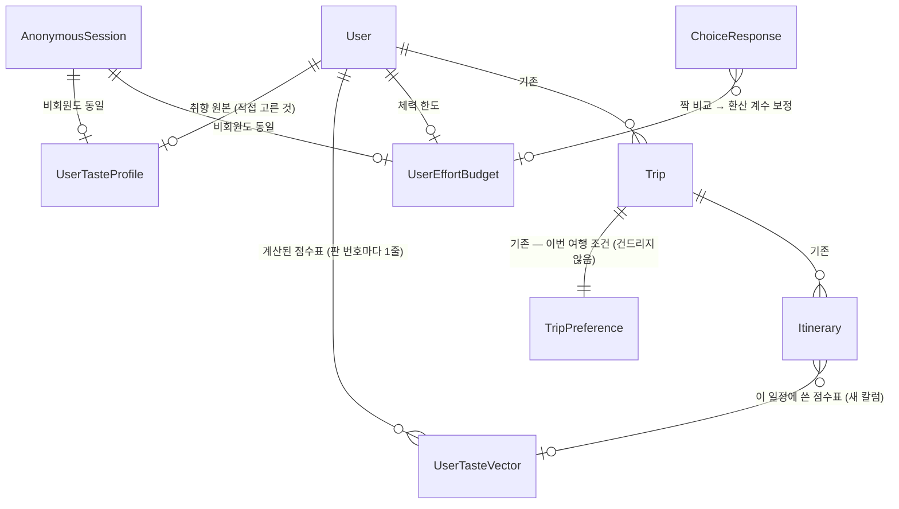

from: janghyojoon
to: jinmiri
at: 2026-08-27T05:49:18.704Z
subject: [ERD 요청] 사용자 취향·부담 저장 테이블 4개 — 용어 전부 풀어서 씁니다

진미리 님께.

장효준입니다. **ERD(데이터베이스 설계도)에 테이블 4개를 새로 그려 주셨으면** 해서 보냅니다.

이 쪽지는 **줄임말을 하나도 안 쓰고** 썼습니다. 제가 다른 사람에게 설명할 때 쓰던 짧은 이름(`UserTasteVector` 같은 것)은 **그 이름만 봐서는 뭔지 알 수 없기 때문에**, 이름마다 "이게 무엇을 담는 서랍인지"를 먼저 적었습니다. 길지만 순서대로 읽으시면 그림이 그려집니다.

---

# 0. 먼저 — 이 쪽지에 나오는 말들

혹시 익숙하지 않으실까 봐 먼저 풀어 둡니다. 아시는 건 건너뛰세요.

| 말 | 뜻 |
|---|---|
| **테이블(table)** | 엑셀 시트 한 장. "회원 명단" 시트, "주문 내역" 시트처럼 한 종류의 정보를 담는 표 |
| **칼럼(column)** | 그 시트의 **세로 줄(열)**. "이름", "이메일" 같은 항목 이름 |
| **행(row)** | 그 시트의 **가로 줄**. 회원 한 명이 한 행 |
| **기본키(Primary Key, PK)** | 행마다 붙는 **겹치지 않는 번호표**. 이게 있어야 "몇 번 행"이라고 가리킬 수 있음 |
| **외래키(Foreign Key, FK)** | **다른 시트의 행을 가리키는 번호**. "주문 내역" 시트에 적힌 회원번호가 이것 |
| **1 대 1 (1:1)** | 한 쪽에 하나만 붙음. 사람 1명 ↔ 주민등록번호 1개 |
| **1 대 다 (1:N)** | 한 쪽에 여러 개가 붙음. 사람 1명 ↔ 주문 여러 건 |
| **JSON 칼럼** | **칸 하나에 목록을 통째로 넣는 칼럼**. 칼럼을 20개 만들 대신 `{"야경":0.8, "매움":0.3}` 이런 덩어리를 한 칸에 넣음. MySQL 8.0 에 `JSON` 이라는 칼럼 종류가 실제로 있습니다 |
| **벡터(vector)** | 겁먹으실 필요 없습니다. **그냥 숫자 여러 개를 나열한 것**입니다. `[0.8, 0.3, 0.5]` 이게 벡터입니다. 여기서는 "취향 항목마다 점수를 매긴 목록" 정도로 읽으시면 됩니다 |
| **배치(batch)** | 사람이 안 보는 시간(새벽 등)에 **한꺼번에 몰아서 도는 작업** |
| **모델(model)** | 여기서는 **추천을 계산하는 프로그램**을 말합니다. AI 라고 불리는 그것 |

---

# 1. 무엇을 만드는 것인가 — 한 문장

**"이 사용자는 무엇을 좋아하고, 무엇을 얼마나 견딜 수 있는가"를 데이터베이스에 저장하는 자리**를 만드는 일입니다.

넷플릭스가 가입 직후에 "좋아하는 작품 3개 고르세요"를 물어보는 것과 같은 자리입니다. LOCAL_ROUTE 에서는 취향 카드 위저드(`/plan/taste` 화면)가 그 역할입니다.

---

# 2. 🔴 가장 중요한 원칙 — 세 가지를 절대 한 테이블에 섞지 않는다

이게 이 설계의 전부입니다. 나머지는 이 원칙에서 자동으로 나옵니다.

우리가 저장해야 할 정보는 성질이 **완전히 다른 세 종류**입니다.

| | 무엇 | 예시 | 지워도 되나 |
|---|---|---|---|
| **①** | 사용자가 **직접 고른 것** | "매운 거 좋아함"을 본인이 체크함 | ❌ **절대 안 됨.** 지우면 복구 불가 |
| **②** | 프로그램이 **계산해 낸 것** | ①을 재료로 만든 취향 점수표 | ✅ **지워도 됨.** ①로 다시 만들면 됨 |
| **③** | 사용자가 **실제로 한 행동** | 추천한 식당을 지우고 다른 걸 넣음 | ❌ 안 됨 (계속 쌓기만 함) |

**왜 섞으면 안 되는가 — 실제로 벌어지는 일 두 가지**

**(가) 프로그램을 새 버전으로 바꿀 때 사고가 납니다.**
추천 프로그램을 1.0 에서 2.0 으로 올리면, ②(계산 결과)는 **전부 다시 계산**해야 합니다. 그런데 ①(사용자가 고른 것)과 ②가 같은 행에 있으면, 다시 계산하는 작업이 ①이 든 행까지 건드립니다. 여기서 실수가 나면 **사용자가 직접 입력한 알레르기 정보가 날아갑니다.** 이건 되돌릴 방법이 없습니다.

**(나) 나중에 물어볼 수 없게 됩니다.**
"이 사용자한테 왜 매운 걸 추천했지? 본인이 그렇게 답한 거야, 아니면 우리가 추측한 거야?" — 한 칸에 있으면 이 질문에 **영원히 답할 수 없습니다.**

그래서 **①은 ①대로, ②는 ②대로 다른 테이블**에 둡니다.

> 💡 헷갈리실까 봐: **테이블을 나눈다고 화면에서 두 번 불러오는 게 아닙니다.**
> 서버가 필요한 것만 골라서 한 번에 내려줍니다. 양말과 속옷을 다른 서랍에 넣는다고 옷 입을 때 두 번 나가는 게 아닌 것과 같습니다.

---

# 3. ③(사용자의 실제 행동)은 이미 ERD 에 있습니다 — 새로 안 만드셔도 됩니다

`docs/LOCAL_ROUTE_기획서_v7.md` 8장에 있는 기존 테이블들입니다.

| 이미 있는 테이블 | 담고 있는 행동 |
|---|---|
| `ItineraryRevision` (일정 변경 이력) | 사용자가 추천받은 장소를 **빼거나 바꾼 기록** |
| `VisitVerification` (방문 인증) | GPS 로 확인된 **실제로 간 곳** |
| `Review` (리뷰) | 갔다 와서 남긴 평가 |

**추천했는데 사용자가 지워버린 것** — 이게 별점 100개보다 정확한 취향 신호입니다. 이미 저장되고 있으니 그대로 쓰면 됩니다.

**딱 한 칼럼만 추가 제안:** `ItineraryRevision` 에 `reason`(변경 사유) 칼럼. 왜 바꿨는지("너무 멀어서" / "안 끌려서")가 없으면 나중에 해석이 안 됩니다.

---

# 4. 새로 그려 주실 테이블 — 4개

이제 본론입니다. 하나씩 **이름의 뜻부터** 적겠습니다.

---

## 테이블 ① `UserTasteProfile`

**이름을 우리말로 풀면:** `User`(사용자) + `Taste`(취향) + `Profile`(신상 카드)
= **"사용자 취향 신상 카드"**

**어디에 붙나:** `User` 테이블에 **1 대 1**로 붙습니다. 사용자 한 명당 이 카드 한 장.

**무엇이 들어가나:** 취향 카드 위저드(`/plan/taste` 화면)에서 사용자가 **직접 고른 답 원본 그대로**. 가공하지 않은 날것.

| 칼럼 이름 | 종류 | 우리말 이름 | 설명 |
|---|---|---|---|
| `id` | 번호 | 행 번호 | 기본키(겹치지 않는 번호표) |
| `userId` | 번호 | 회원 번호 | `User` 테이블을 가리키는 외래키 |
| `anonymousSessionId` | 번호 | 비회원 번호 | 아래 🔴 설명 참고 |
| `answers` | JSON | **답변 원본** | `{"기분":"힐링", "활동":["야경","카페"], "못먹는것":["돼지고기"], "음식":["밀면","씨앗호떡"]}` 같은 덩어리 |
| `surveyVersion` | 짧은 글자 | **질문지 판 번호** | `"taste-survey-v1"` 같은 값. 아래 🔴 설명 참고 |
| `createdAt` | 시각 | 만든 시각 | |
| `updatedAt` | 시각 | 고친 시각 | |

🔴 **`anonymousSessionId` 가 왜 있나** — 우리 서비스는 로그인 안 해도 여행을 만들 수 있습니다. 기존 `Trip`(여행) 테이블이 이미 `User`(회원)와 `AnonymousSession`(비회원 방문) **둘 다에서 연결**되게 돼 있습니다. 취향도 똑같아야 합니다. 안 그러면 비회원은 취향을 저장할 자리가 없습니다. **`Trip` 이 하는 방식을 그대로 따라 그리시면 됩니다.**

🔴 **`surveyVersion`(질문지 판 번호)이 왜 꼭 필요한가** — 나중에 설문 문항을 고칠 겁니다. 3번 질문이 "좋아하는 분위기"였다가 "선호 예산"으로 바뀌면, **예전에 저장된 답이 무슨 질문에 대한 답이었는지 알 수 없게 됩니다.** 판 번호가 있으면 "아, 이건 1판 질문지의 답이구나" 하고 해석할 수 있습니다. 이거 없으면 예전 데이터가 통째로 쓰레기가 됩니다.

---

## 테이블 ② `UserTasteVector`

**이름을 우리말로 풀면:** `User`(사용자) + `Taste`(취향) + `Vector`(숫자 목록)
= **"프로그램이 계산해 낸 사용자 취향 점수표"**

**이게 뭔지 한 번 더 쉽게:** ①의 답변("야경 좋아함", "매운 거 잘 먹음")을 **프로그램이 숫자로 바꿔 놓은 표**입니다.

```
{ "야경": 0.8, "매움": 0.3, "카페": 0.6, "전통시장": 0.1 }
```

추천할 때 장소마다 이 점수를 매겨서 높은 순으로 고릅니다. 기획서 7.1절의 점수 계산식에서 `w1·TasteMatch` 라고 적힌 부분에 들어가는 값이 바로 이겁니다.

**어디에 붙나:** `User` 테이블에 **1 대 다(1:N)**. 즉 **사용자 한 명에게 여러 줄**이 생깁니다.

| 칼럼 이름 | 종류 | 우리말 이름 | 설명 |
|---|---|---|---|
| `id` | 번호 | 행 번호 | 기본키 |
| `userId` | 번호 | 회원 번호 | 외래키 |
| `anonymousSessionId` | 번호 | 비회원 번호 | ①과 같은 이유 |
| `modelVersion` | 짧은 글자 | **계산 프로그램 판 번호** | `"taste-model-v1"` |
| `vector` | JSON | **점수표** | 위의 `{"야경":0.8,...}` |
| `source` | 짧은 글자 | **무엇으로 만들었나** | `SURVEY_ONLY`(설문만으로) / `SURVEY_PLUS_BEHAVIOR`(설문 + 실제 행동까지 반영) |
| `isActive` | 참/거짓 | **지금 쓰는 것인가** | 사용자당 참인 줄이 **딱 하나** |
| `computedAt` | 시각 | 계산한 시각 | |

🔴 **왜 1 대 1 이 아니라 1 대 다인가 — 이게 이 테이블의 존재 이유입니다.**

추천 프로그램을 2.0 으로 바꿀 때, 1.0 이 만든 점수표를 **덮어써 버리면 되돌릴 수가 없습니다.** 2.0 이 이상하게 동작해도 1.0 의 결과가 이미 사라졌으니까요.

여러 줄로 두면:
- 2.0 을 켤 때 1.0 줄을 **놔둔 채** 2.0 줄을 새로 추가
- 뭐가 더 나은지 나란히 비교 가능
- 2.0 이 이상하면 **`isActive`(지금 쓰는 것인가)를 1.0 쪽으로 되돌리기만** 하면 끝

**한 줄짜리 칸에는 이게 안 들어갑니다.** 그래서 1 대 다입니다.

---

## 테이블 ③ `UserEffortBudget`

**이름을 우리말로 풀면:** `User`(사용자) + `Effort`(힘듦·체력 소모) + `Budget`(예산)
= **"이 사용자가 하루에 견딜 수 있는 체력 한도"**

🔴 **이 테이블은 bigData 파트(부산 이동성 데이터 담당) 요청으로 들어왔습니다.** 근거 문서는 `bigData/docs/ONTOLOGY.md` 5절입니다.

**왜 ②(점수표)로 안 되고 따로 필요한가 — 여기가 핵심이고 저도 처음에 놓쳤습니다.**

"좋아하는가"와 "감당할 수 있는가"는 **완전히 다른 질문**입니다.

점수표 방식으로 하면 이런 일이 생깁니다:
> "걷기 싫어함 → −0.3점" 이라고 넣어둠
> 그런데 "산 좋아함 → +0.4점" 이 있으면 **합쳐서 +0.1점이 되어 추천됩니다**
> 무릎이 안 좋은 사용자에게 계단 200개짜리 마을을 추천하게 됩니다

사용자가 "그건 안 된다"고 한 것은 **다른 점수로 상쇄되면 안 된다**는 뜻입니다. 그래서 점수가 아니라 **한도(예산)** 로 둡니다. **한도를 넘으면 아무리 점수가 높아도 제외**입니다.

| 칼럼 이름 | 종류 | 우리말 이름 | 설명 |
|---|---|---|---|
| `id` | 번호 | 행 번호 | 기본키 |
| `userId` / `anonymousSessionId` | 번호 | 회원/비회원 번호 | 외래키 |
| `walkMinutes` | 숫자 | 하루 걷는 시간 한도 (분) | 예: 90 |
| `ascentMeters` | 숫자 | 하루 오르막 총 높이 한도 (m) | 예: 120 |
| `sustainedRunMax` | 숫자 | **한 번에 견디는 연속 오르막 최대 길이 (m)** | 예: 80. 아래 설명 |
| `stairSteps` | 숫자 | 하루 계단 단수 한도 | 예: 150 |
| `unshadedMinutes` | 숫자 | 그늘 없이 걷는 시간 한도 (분) | 예: 30 |
| `noSidewalkMeters` | 숫자 | 인도 없는 길 걷는 거리 한도 (m) | 예: 0 |
| `source` | 짧은 글자 | 어디서 나온 값인가 | `SURVEY`(설문) / `DEFAULT`(기본값) / `CALIBRATED`(짝 비교로 보정됨) |
| `updatedAt` | 시각 | 고친 시각 | |

**`sustainedRunMax`(연속 오르막 최대 길이)가 왜 따로 있나:** 총 오르막 100m 를 열 번 나눠 오르는 것과, 한 번에 100m 를 오르는 것은 **몸이 느끼는 힘듦이 완전히 다릅니다.** 합계만으로는 이 차이가 안 보입니다.

**이게 있으면 공짜로 얻는 것:** 왜 뺐는지 설명이 자동으로 나옵니다.
> *"흰여울문화마을은 연속 오르막이 180m 라 회원님 기준(80m)을 넘습니다"*

점수 방식으로는 이 문장이 **절대 안 나옵니다.** 점수는 "3.2점"이라고만 하지 어디가 문제인지 말을 못 하니까요.

---

## 테이블 ④ `ChoiceResponse`

**이름을 우리말로 풀면:** `Choice`(선택) + `Response`(응답)
= **"둘 중 하나 고르기 설문의 응답 기록"**

🔴 **이것도 bigData 파트 요청입니다.** 근거: `bigData/docs/ONTOLOGY.md` 6절, `bigData/docs/FIELD-STUDY.md`.

**이게 무슨 설문인가:** 경로 카드 두 장을 나란히 보여주고 하나 고르게 하는 문항입니다.

```
        A                          B
  12분 걷기 · 오르막         18분 걷기 · 평지
  계단 40단                  계단 없음

        어느 쪽으로 가시겠어요?
```

**왜 필요한가:** ③번 테이블(체력 한도)의 숫자들을 서로 비교하려면 **환산 비율**이 필요합니다.
> "경사 8% 를 100m 오르는 것 = 평지 240m 걷는 것"

이 **240** 이라는 숫자를 우리가 마음대로 정하면 안 됩니다. 근거가 없으니까요. 이 숫자는 **실제 사람들이 A/B 중 뭘 골랐는지를 모아서 통계로 뽑아냅니다.**

| 칼럼 이름 | 종류 | 우리말 이름 | 설명 |
|---|---|---|---|
| `id` | 번호 | 행 번호 | 기본키 |
| `respondentId` | 짧은 글자 | **응답자 익명 번호** | 🔴 실명 아님. 아래 설명 |
| `questionSetId` | 짧은 글자 | **문항 세트 번호** | 🔴 아래 설명 |
| `questionIndex` | 숫자 | 몇 번째 문항인가 | 1~14 |
| `optionA` | JSON | A 카드 내용 | `{"도보분":12,"경사":"오르막","계단":40,"환승":0}` |
| `optionB` | JSON | B 카드 내용 | `{"도보분":18,"경사":"평지","계단":0,"환승":1}` |
| `chosen` | 글자 1자 | 무엇을 골랐나 | `A` 또는 `B` |
| `responseMs` | 숫자 | **답하는 데 걸린 시간 (밀리초)** | 🔴 아래 설명 |
| `createdAt` | 시각 | 응답 시각 | |

🔴 **`respondentId`(응답자 익명 번호)가 왜 필요한가** — **홀드아웃 검증**(**hold-out — 데이터의 일부를 일부러 빼놓고 계산한 뒤, 빼놓은 걸로 답을 맞춰보는 검증 방법. 시험 문제를 미리 안 보고 푸는 것과 같음**)을 하려면 "같은 사람의 응답"을 묶을 수 있어야 합니다. **같은 사람 응답으로 검증하면 당연히 잘 맞으니까 검증이 무의미해집니다.** 사람 단위로 갈라야 합니다.

🔴 **`questionSetId`(문항 세트 번호)가 왜 필요한가** — A/B 카드 조합은 **미리 계산해서 만들어 둔 조합표**를 씁니다(직교배열이라고 부릅니다 — **여러 조건을 골고루 섞어서 서로 겹치지 않게 배치한 표**). 즉석에서 아무렇게나 만들면 "도보시간 긴 카드에는 항상 계단도 많다" 같은 편향이 생겨서 **어느 쪽이 원인인지 구분이 안 됩니다.** 세트 번호가 있어야 어느 조합표를 썼는지 되찾을 수 있습니다.

🔴 **`responseMs`(응답 소요 시간)가 왜 필요한가** — **3초 미만은 안 읽고 누른 것**입니다. 걸러내야 통계가 살아납니다. 이 칼럼이 없으면 대충 누른 응답과 진짜 고민한 응답을 **구분할 방법이 영영 없습니다.**

---

# 5. 🔴 받으면 안 되는 것 — 개인정보

`ChoiceResponse` 테이블에 **아래는 절대 넣지 않습니다.**

| 넣지 말 것 | 이유 |
|---|---|
| 이름 · 연락처 | 필요 없음 |
| GPS 이동 궤적 | 이건 개인 위치정보라 법적 책임이 따라옵니다 |
| 기기 식별자 | 사람을 계속 추적하게 됨 |

**익명 번호 하나만 만들고, 설문 끝나면 버립니다.**
**안 받으면 지킬 것도 없습니다.** 이게 가장 안전한 설계입니다.

---

# 6. 기존 `TripPreference` 테이블은 그대로 두세요 — 다른 물건입니다

헷갈리기 쉬운 부분이라 따로 적습니다. 지금 ERD 에는 `TripPreference`(여행 조건)가 이미 `Trip`(여행)에 1 대 1로 붙어 있습니다. **그건 지우지도 고치지도 마세요.**

| | `UserTasteProfile` (새로 만들 것) | `TripPreference` (이미 있는 것) |
|---|---|---|
| 무엇에 대한 것 | **이 사람** | **이번 여행** |
| 예시 | "매운 거 좋아함, 돼지고기 못 먹음" | "이번엔 부모님이랑 3박, 예산 넉넉" |
| 여행이 끝나면 | **남음** | 그 여행과 함께 끝 |

지금은 취향이 **여행 안에 갇혀 있습니다.** 그래서 같은 사람이 두 번째 여행을 만들면 **알레르기를 처음부터 다시 물어봐야 합니다.** 사람 단위 테이블을 따로 빼는 이유가 이겁니다.

---

# 7. 기존 `Itinerary` 테이블에 칼럼 2개만 추가

`Itinerary`(완성된 일정) 테이블에 아래 두 칼럼을 추가해 주세요.

| 칼럼 | 설명 |
|---|---|
| `tasteVectorId` | 이 일정을 만들 때 **어느 점수표를 썼는가** (②번 테이블을 가리키는 외래키) |
| `modelVersion` | 이 일정을 만든 **프로그램 판 번호** |

**왜 필요한가:** 3주 뒤에 "이 일정 왜 이렇게 나왔지?"를 물었을 때, **그때 어떤 점수표를 썼는지가 안 남아 있으면 영원히 재현할 수 없습니다.**

🔴 **지금은 표에 줄 두 개 긋는 일이지만, 데이터가 쌓인 뒤에는 기존 행을 전부 채우는 일이 됩니다.** (기획서 8.4절이 같은 말을 하고 있습니다.)

---

# 8. 관계도 초안

그리실 때 참고하시라고 mermaid(**글로 써서 그림을 그리는 문법. GitLab 이 이걸 읽어서 자동으로 도표로 보여줍니다**) 로 적어 둡니다. 그대로 쓰셔도 되고 도구로 다시 그리셔도 됩니다.



기호 읽는 법: `||--o|` 는 **1 대 1**(있을 수도 없을 수도), `||--o{` 는 **1 대 다**(여러 개 붙음) 입니다.

---

# 9. 🔴 이건 확정이 아니라 [제안] 입니다

- 팀이 아직 승인하지 않았습니다. **제안 상태로 그려 주시고 문서에 [제안] 이라고 표시해 주세요**
- `bigData/docs/ONTOLOGY.md` 는 아직 커밋 안 된 상태로 보입니다. 브랜치 `feat/bigData/S15P21E201-23-choice-experiment` 도 제 쪽에서는 아직 안 보입니다
- 이견 있으시면 그게 더 좋습니다. 그리기 전에 알려 주세요

# 10. 시작 전에 한 가지만

파일 고치기 전에 **선점**(다른 사람이 같은 파일을 동시에 고치는 걸 막는 장치)을 먼저 잡아 주세요. 팀 규칙 1번입니다.

```
node ci/axmap/bin/axmap.mjs claim docs/LOCAL_ROUTE_기획서_v7.md --task S15P21E201-XX --intent "사용자 취향·부담 ERD 추가"
```

궁금한 거 있으시면 쪽지 주세요. 어느 항목이든 다시 풀어서 설명드리겠습니다.

— 장효준
